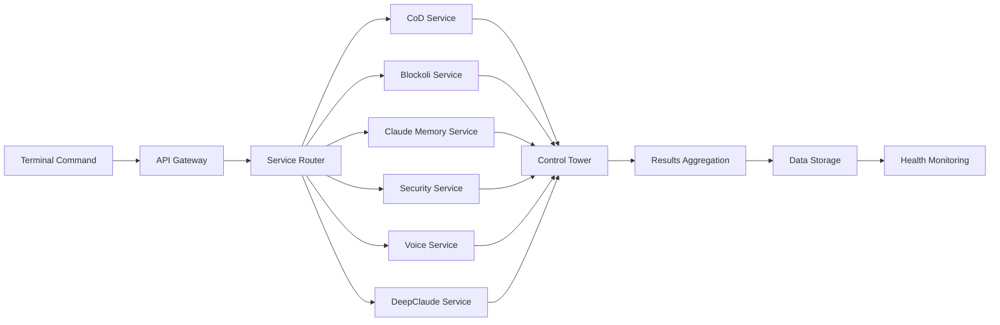

# UltraMCP Supreme Stack + Claude Code Integration

This document provides optimized workflows for using UltraMCP Supreme Stack with Claude Code to achieve maximum developer productivity. **All 9 microservices are fully integrated with zero loose components.**

## 🚀 Complete Integration Overview

The UltraMCP Supreme Stack features complete microservices integration with the latest Claude Code Memory and Sam MCP Tool additions:

### ✅ **9 Fully Integrated Services**
1. **🎭 Chain-of-Debate Service** - Enhanced multi-LLM orchestration
2. **🔒 Asterisk Security Service** - Enterprise security scanning and compliance
3. **🧠 Blockoli Code Intelligence** - Advanced semantic code analysis  
4. **🗣️ Voice System Service** - Real-time voice processing with WebSocket support
5. **🤖 DeepClaude Metacognitive Engine** - Advanced reasoning and decision-making
6. **🧠 Claude Code Memory** - **NEW!** Tree-sitter AST parsing + Qdrant semantic search
7. **🎯 Sam MCP Tool** - **NEW!** Autonomous agent with LangGraph integration and local LLM priority
8. **🎛️ Control Tower Orchestration** - Central coordination hub for all services
9. **🌐 Backend API Gateway** - Unified proxy routing to all microservices

### ✅ **Zero Loose Components Guarantee**
- **Complete Docker Orchestration**: All services in `docker-compose.hybrid.yml`
- **Unified API Gateway**: Proxy routing to all services with error handling
- **Comprehensive Database Schema**: Support for all 9 services in `database/schemas/init.sql`
- **Environment Configuration**: Complete service URLs and configuration in `.env.example`
- **Integration Verification**: `make verify-integration` ensures no loose components
- **Health Monitoring**: System-wide health checks and status aggregation

## Quick Start Commands

The UltraMCP Supreme Stack is designed for terminal-first operation with Claude Code. Use these commands frequently:

### Core System Commands
```bash
# System management
make start                    # Interactive startup menu
make status                   # Check all 7 services status
make verify-integration       # 🔍 Ensure no loose components (NEW!)
make health-check            # Comprehensive health check across all services
make logs                    # View system logs

# Docker operations
make docker-hybrid           # Start complete integrated stack (9 services)
make docker-dev             # Development mode with hot reload
make docker-logs            # View container logs for all services
```

### AI Operations (80% Terminal-First)
```bash
# Quick AI chat (OpenAI API)
make chat TEXT="Explain quantum computing"

# Local AI chat (5 models available, fully offline)
make local-chat TEXT="Explain quantum computing"

# Enhanced Chain-of-Debate Protocol (with full service integration)
make cod-local TOPIC="Should we invest in AI research?"      # 100% local debate
make cod-hybrid TOPIC="Architecture decision for X"         # Mix local + API
make cod-privacy TOPIC="Sensitive business decision"        # Privacy-first mode
make cod-cost-optimized TOPIC="Budget allocation strategy"   # Minimize API costs

# 🧠 Code Intelligence Operations (NEW!)
make index-project PROJECT="/path/to/code" NAME="my-project"   # Index codebase for analysis
make code-search QUERY="authentication logic" PROJECT="my-project"  # Semantic code search
make code-debate TOPIC="Refactor user auth" PROJECT="my-project"    # Code-intelligent AI debate
make architecture-analysis FOCUS="security" PROJECT="my-project"    # Architecture analysis
make pattern-analysis PATTERN="singleton" PROJECT="my-project"      # Code pattern analysis

# 🔒 Security Operations (NEW!)
make security-scan PATH="/app" TYPE="vulnerability"         # Comprehensive vulnerability scan
make compliance-check FRAMEWORK="SOC2" TARGET="/app"        # Compliance validation
make threat-model SYSTEM="web-app" SCOPE="auth"            # Advanced threat modeling

# 🗣️ Voice System Operations (NEW!)
make voice-session TYPE="conversation" AI="enabled"         # Start AI voice session
make voice-transcribe FILE="audio.wav"                     # Transcribe audio files
make voice-analyze SESSION="session-123"                   # Analyze voice sessions

# Quick development decisions (local only)
make dev-decision DECISION="React vs Vue for this component?"

# Web research with AI analysis
make research URL="https://anthropic.com"

# Data analysis with AI insights  
make analyze FILE="data/research/report.json"
```

### Enhanced Local LLM Operations (Offline AI)
```bash
# List available local models (5 models: Qwen 2.5 14B, Llama 3.1 8B, etc.)
make local-models

# Direct local model chat (zero cost, maximum privacy)
make local-chat TEXT="Write a Python function to sort data"

# Check local LLM system status
make local-status

# Download additional models
make local-pull MODEL="llama3.2"

# Remove unused models
make local-remove MODEL="old-model"

# Test local model performance
make test-cod-performance
```

# Download new models
make local-pull MODEL="codellama:7b"
```

### 🧠 Claude Code Memory Operations (Advanced Semantic Analysis)
```bash
# Project indexing for semantic memory
make memory-index PROJECT="/path/to/code" NAME="my-project"   # Index project for semantic search
make memory-learn-codebase                                    # Learn entire UltraMCP codebase

# Semantic code search with memory
make memory-search QUERY="authentication logic" PROJECT="my-project"     # Smart code search
make memory-find-similar PATTERN="design pattern" PROJECT="my-project"   # Find similar code
make memory-analyze FILE="src/auth.py" PROJECT="my-project"              # Pattern analysis

# Memory-enhanced workflows
make memory-debate TOPIC="architecture decision" PROJECT="my-project"    # Memory-informed debates
make memory-quality-check FILE="src/main.py" PROJECT="my-project"        # Quality assessment
make memory-explore                                                       # Interactive exploration

# Memory management
make memory-projects                                          # List indexed projects
make memory-status                                           # Check memory service status
make test-memory-integration                                 # Test memory integration
make memory-help                                            # Full memory commands guide
```

### Web Automation (Playwright MCP)
```bash
# Web scraping
make web-scrape URL="https://news.ycombinator.com"

# Website testing
make test-site URL="https://example.com"

# Web monitoring
make web-monitor URL="https://api.example.com"
```

## Claude Code Productivity Tips

### 1. Use Terminal Commands for Speed
- **80% of tasks**: Use `make` commands directly in terminal
- **20% of complex workflows**: Use enhanced CoD Protocol for multi-LLM coordination
- **Local-first approach**: Prefer `make cod-local` and `make local-chat` for privacy and zero cost
- **Always prefer**: Terminal commands over complex orchestration

### 2. Efficient File Management
```bash
# View logs quickly
make logs | grep ERROR

# Search specific log entries  
make logs-search QUERY="debate"

# Tail live logs while developing
make logs-tail
```

### 3. Enhanced Development Workflow
```bash
# Start development environment
make docker-dev

# Test with local models (zero cost)
make local-chat TEXT="test my changes"

# Quick development decisions
make dev-decision DECISION="Should I refactor this function?"

# Local-only debates for architecture decisions
make cod-local TOPIC="Microservices vs monolith for this feature"

# Check system health
make health-check
```

### 4. Debugging Commands
```bash
# Check service status
make status

# Check local model availability
make local-status

# View container logs
make docker-logs

# Test local model performance
make test-cod-performance

# Check fallback systems
make fallback-status

# Interactive container access
docker exec -it ultramcp-terminal bash
docker exec -it ultramcp-cod-service bash
```

## API Keys Configuration

Set these environment variables in `.env`:

```bash
# Optional for API-based AI operations (local models work without these)
OPENAI_API_KEY=sk-your-key-here
ANTHROPIC_API_KEY=claude-your-key-here

# Note: Local models (make local-chat, make cod-local) work completely offline
# and require no API keys - perfect for privacy and zero cost operation

# Optional for enhanced features
POSTGRES_PASSWORD=your-secure-password
REDIS_PASSWORD=your-redis-password
```

## 🏛️ Complete Integration Architecture

### Terminal-First Approach (80%)
1. User runs terminal commands (`make local-chat`, `make web-scrape`, etc.)
2. **API Gateway** routes requests to appropriate microservices
3. **Local models** process requests offline (zero cost, maximum privacy)
4. **Cross-service coordination** via Control Tower when needed
5. Results saved to `data/` directory with complete audit trail
6. Logs written to `logs/combined.log` with service-level tracking

### Advanced Orchestration (20%)
1. User runs `make cod-local`, `make code-debate`, or `make security-scan`
2. **Control Tower** coordinates multiple integrated services:
   - **Enhanced CoD** orchestrates multi-LLM debates
   - **Blockoli Intelligence** provides code context and analysis
   - **Claude Code Memory** provides semantic code search and pattern analysis
   - **Asterisk Security** performs security validation
   - **Voice System** enables voice-based interactions
   - **DeepClaude Engine** adds metacognitive reasoning
3. **Cross-service workflows** with unified data flow
4. **Comprehensive results** with privacy scores, security analysis, and cost tracking

### 🔗 Service Integration Flow


## 📁 Complete File Structure for Claude Code

When working with Claude Code, focus on these integrated components:

### 🛠️ Scripts Directory (`/scripts/`)
- `verify-integration.sh` - **🔍 Complete integration verification (NEW!)**
- `enhanced-cod-terminal.py` - Enhanced CoD Protocol with local models
- `local-llm-chat.sh` - Local model chat (offline, zero cost)
- `common.sh` - Shared utilities and logging
- `simple-chat.sh` - Direct AI chat via API
- `cod-debate.sh` - Original multi-LLM debate
- `playwright-scrape.sh` - Web automation
- `web-research.sh` - Research pipeline
- `analyze-data.sh` - Data analysis with AI
- `health-check.sh` - System health monitoring

### 🧠 Services Directory (`/services/`) - **Complete Integration**
#### 🎭 Chain-of-Debate (`/services/chain-of-debate/`)
- `enhanced_orchestrator.py` - Local+API hybrid orchestration
- `orchestrator.py` - Multi-LLM coordination
- `entrypoint.py` - FastAPI service entry

#### 🔒 Asterisk Security (`/services/asterisk-mcp/`)
- `asterisk_security_service.py` - **FastAPI security service**
- `asterisk_security_client.py` - Security scanner client
- `Dockerfile` - Container configuration
- `requirements.txt` - Python dependencies

#### 🧠 Blockoli Intelligence (`/services/blockoli-mcp/`)
- `blockoli_service.py` - **FastAPI code intelligence service**
- `blockoli_client.py` - Blockoli integration client
- `code_intelligent_cod.py` - Code-intelligent CoD protocol
- `Dockerfile` - Container configuration
- `requirements.txt` - Python dependencies

#### 🗣️ Voice System (`/services/voice-system/`)
- `voice_service.py` - **FastAPI voice service with WebSocket**
- `core/voice_api.py` - Voice processing engine
- `voice_api_langwatch.py` - Langwatch integration
- `Dockerfile` - Container configuration
- `requirements.txt` - Python dependencies

#### 🤖 DeepClaude (`/services/deepclaude/`)
- `deepclaude_service.py` - **FastAPI reasoning service**
- `deepclaude_client.py` - Reasoning engine client
- `Dockerfile` - Container configuration
- `requirements.txt` - Python dependencies

#### 🎛️ Control Tower (`/services/control-tower/`)
- `control_tower_service.js` - **Node.js orchestration service**
- `Dockerfile` - Container configuration
- `package.json` - Node.js dependencies

### 💾 Database Integration (`/database/`)
- `schemas/init.sql` - **🗄️ Unified schema for all 7 services**
- Complete tables for CoD, Security, Blockoli, Voice, DeepClaude, Control Tower
- Cross-service tracking and metrics
- Performance indexes and monitoring views

### 📱 Backend API Gateway (`/apps/backend/`)
- `src/index.js` - **🌐 Complete API Gateway with proxy routing**
- `package.json` - Updated with `http-proxy-middleware`
- Unified routing to all 7 microservices
- Health aggregation and status endpoints

### 📊 Data Directory (`/data/`) - **Enhanced Organization**
- `local_cod_debates/` - Enhanced CoD Protocol results with local models
- `security_scans/` - **Security scan results and reports**
- `code_intelligence/` - **Blockoli analysis results**
- `voice_sessions/` - **Voice processing data**
- `reasoning/` - **DeepClaude reasoning outputs**
- `orchestrations/` - **Control Tower coordination logs**
- `local_llm/` - Local model chat results
- `debates/` - Original CoD Protocol results
- `scrapes/` - Web scraping results  
- `research/` - Research reports
- `analysis/` - Data analysis results

### ⚙️ Configuration Files - **Complete Integration**
- `Makefile` - **✅ Terminal command interface with integration verification**
- `docker-compose.hybrid.yml` - **✅ Complete 7-service orchestration**
- `.env.example` - **✅ Complete environment configuration**
- `CLAUDE.md` - **Updated with complete integration guide**
- `README.md` - **Updated with Supreme Stack overview**

## 🚀 Enhanced Workflows with Complete Integration

### 1. **🔍 Integration Verification Workflow (NEW!)**
```bash
# Step 1: Verify all services are integrated (no loose components)
make verify-integration

# Step 2: Check system health across all 9 services
make health-check

# Step 3: Start complete integrated system
make docker-hybrid

# Step 4: Test cross-service functionality
make cod-local TOPIC="Test integrated services"
make code-search QUERY="test" PROJECT="ultramcp"
make security-scan PATH="/app" TYPE="quick"
```

### 2. **🧠 Code Intelligence Workflow (NEW!)**
```bash
# Step 1: Index your project for semantic analysis
make index-project PROJECT="/path/to/your/code" NAME="my-app"

# Step 2: Perform semantic code search
make code-search QUERY="authentication logic" PROJECT="my-app"

# Step 3: Run code-intelligent AI debate
make code-debate TOPIC="Should we refactor the auth system?" PROJECT="my-app"

# Step 4: Generate architecture analysis
make architecture-analysis FOCUS="security" PROJECT="my-app"

# Step 5: Review results with code context
cat data/code_intelligence/my-app_analysis.json | jq .insights
```

### 3. **🧠 Claude Code Memory Workflow (NEW!)**
```bash
# Step 1: Index your codebase for semantic memory
make memory-index PROJECT="/path/to/your/code" NAME="my-project"

# Step 2: Learn UltraMCP patterns for enhanced assistance  
make memory-learn-codebase

# Step 3: Perform intelligent code search
make memory-search QUERY="authentication patterns" PROJECT="my-project"

# Step 4: Analyze code patterns and quality
make memory-analyze FILE="src/auth/login.py" PROJECT="my-project"

# Step 5: Memory-enhanced architectural debates
make memory-debate TOPIC="Refactor authentication system" PROJECT="my-project"

# Step 6: Quality assessment with memory insights
make memory-quality-check FILE="src/main.py" PROJECT="my-project"

# Step 7: Find similar code implementations
make memory-find-similar PATTERN="singleton pattern" PROJECT="my-project"

# Step 8: Interactive memory exploration
make memory-explore
```

### 4. **🔒 Security Analysis Workflow (NEW!)**
```bash
# Step 1: Comprehensive vulnerability scan
make security-scan PATH="/app" TYPE="comprehensive"

# Step 2: Compliance validation
make compliance-check FRAMEWORK="SOC2" TARGET="/app"

# Step 3: Threat modeling
make threat-model SYSTEM="web-app" SCOPE="authentication"

# Step 4: Generate security report with recommendations
make security-report TYPE="detailed" FORMAT="json"

# Step 5: Review security insights
cat data/security_scans/scan_*_report.json | jq .recommendations
```

### 5. **🗣️ Voice-Enhanced AI Workflow (NEW!)**
```bash
# Step 1: Start AI-enabled voice session
make voice-session TYPE="conversation" AI="enabled"

# Step 2: Transcribe and analyze voice input
make voice-transcribe FILE="meeting.wav"

# Step 3: Run voice-guided CoD debate
make cod-local TOPIC="Decision from voice meeting" CONTEXT="voice-session-123"

# Step 4: Analyze voice session insights
make voice-analyze SESSION="session-123"
```

### 6. **🎭 Enhanced Multi-Service CoD Workflow**
```bash
# Step 1: Prepare comprehensive context
make index-project PROJECT="/my/code" NAME="enterprise-app"
make security-scan PATH="/my/code" TYPE="baseline"

# Step 2: Run integrated CoD with all services
make code-debate TOPIC="Microservices migration strategy" PROJECT="enterprise-app"

# Step 3: Include security and reasoning analysis
# (Automatically includes Blockoli code context, Asterisk security insights, 
#  and DeepClaude metacognitive reasoning)

# Step 4: Review comprehensive results
cat data/local_cod_debates/integrated_*_results.json | jq .consensus
```

### 7. **📊 Research Workflow (Enhanced)**
```bash
# Step 1: Scrape content with security validation
make web-scrape URL="https://research-site.com"

# Step 2: Analyze with AI and security insights
make research URL="https://research-site.com"

# Step 3: Cross-reference with code intelligence
make code-search QUERY="related patterns" PROJECT="my-app"

# Step 4: Generate comprehensive report
cat data/research/task_*_research.json | jq .summary
```

### 8. **🏗️ Complete Development Workflow**
```bash
# Step 1: Start integrated development environment
make docker-hybrid

# Step 2: Verify all services are running
make verify-integration

# Step 3: Index your codebase for intelligence
make index-project PROJECT="$(pwd)" NAME="current-project"

# Step 4: Develop with AI assistance
make local-chat TEXT="Help me implement feature X"

# Step 5: Security validation during development
make security-scan PATH="./src" TYPE="development"

# Step 6: Code-intelligent decision making
make code-debate TOPIC="Best approach for feature X" PROJECT="current-project"

# Step 7: Test and validate
make test-cross-services
```

### 9. **🎛️ Control Tower Orchestration Workflow**
```bash
# Step 1: Check Control Tower status
curl http://localhost:3001/api/orchestrate/status

# Step 2: Run complex multi-service workflow
curl -X POST http://localhost:3001/api/orchestrate/workflow \
  -H "Content-Type: application/json" \
  -d '{"type": "code-security-analysis", "project": "my-app"}'

# Step 3: Monitor real-time progress via WebSocket
# Connect to ws://localhost:8008 for live updates

# Step 4: Review orchestration results
curl http://localhost:3001/api/orchestrate/results/workflow-123
```

## 🚀 Performance Optimization with Complete Integration

### For Maximum Speed (80% Usage)
1. **Use `make local-chat`** for zero-cost AI interactions (5 local models)
2. **Use `make verify-integration`** before starting work (ensures no issues)
3. **Use service-specific commands** for targeted operations:
   - `make code-search` for quick code lookups
   - `make security-scan` for targeted security checks
   - `make voice-transcribe` for audio processing
4. **Cache results** - Integration verification caches health status
5. **Use API Gateway** - Single entry point optimizes routing

### For Development (Complete Integration)
1. **Start with integration verification**: `make verify-integration`
2. **Use `make docker-dev`** for hot reload across all 7 services
3. **Monitor in real-time**: `make logs-tail` shows all service logs
4. **Check health frequently**: `make health-check` monitors all services
5. **Use cross-service debugging**:
   ```bash
   make debug-service SERVICE="blockoli"
   make restart-service SERVICE="voice-system"
   make scale-service SERVICE="cod-service" REPLICAS=3
   ```

### For Production (Zero Loose Components)
1. **Complete integration deployment**: `make docker-hybrid` 
2. **Continuous health monitoring**: `make health-check` across all services
3. **Automated backups**: `make backup` includes all service data
4. **Integration verification**: Run `make verify-integration` in CI/CD
5. **Service coordination**: Control Tower manages load balancing
6. **Security monitoring**: Asterisk service provides continuous scanning
7. **Performance metrics**: All services report to unified monitoring

### 🔧 Integration Best Practices

#### Before Starting Development
```bash
# Essential pre-development checklist
make verify-integration          # Ensure no loose components
make health-check               # Verify all services healthy
make local-status              # Check local models available
make docker-hybrid             # Start integrated environment
```

#### During Development
```bash
# Continuous integration monitoring
make status                    # Check service status
make logs-search QUERY="error" # Find issues quickly
make api-gateway-status        # Verify routing working
make websocket-status         # Check real-time connections
```

#### For Complex Decisions
```bash
# Use integrated multi-service analysis
make code-debate TOPIC="..." PROJECT="..."    # Code-intelligent decisions
make security-scan PATH="..." TYPE="..."      # Security validation
make cod-hybrid TOPIC="..." CONTEXT="..."     # Hybrid local+API analysis
```

#### Error Recovery
```bash
# Automated recovery procedures
make verify-integration        # Identify loose components
make restart-service SERVICE="problematic-service"
make cross-service-test       # Test inter-service communication
make fallback-status          # Check fallback systems
```

## Claude Code Best Practices

### 1. Command Patterns
- Always use `make` commands for consistency
- Check `make help` when unsure
- Use `make status` before troubleshooting

### 2. Error Handling
- All scripts include comprehensive error handling
- Check `logs/combined.log` for detailed errors
- Use recovery suggestions provided in error messages

### 3. Data Management
- Results auto-saved with task IDs
- Use `data/` directory for all outputs
- Clean old data with `make clean`

### 4. Service Integration
- CoD Protocol service auto-starts when needed
- Database and Redis auto-configured
- Docker containers auto-restart

## Troubleshooting

### Common Issues

**CoD Service Not Responding**
```bash
make status
make docker-logs
# Restart if needed
make docker-rebuild
```

**Missing Dependencies**
```bash
make setup
pip3 install -r requirements.txt
```

**API Key Issues**
```bash
# Check .env file
cat .env | grep API_KEY
# Update with valid keys
```

**Docker Issues**
```bash
make docker-clean
make docker-rebuild
```

## Integration Examples

### Example 1: Quick Research
```bash
# Claude Code prompt: "Research latest AI trends"
make research URL="https://arxiv.org/list/cs.AI/recent"
```

### Example 2: Data Analysis
```bash
# Claude Code prompt: "Analyze this CSV file"
make analyze FILE="sales_data.csv"
```

### Example 3: Complex Decision
```bash
# Claude Code prompt: "Help decide on architecture"
make debate TOPIC="Microservices vs Monolith for our use case"
```

This integration provides the perfect balance of terminal-first productivity (80%) with advanced AI orchestration capabilities (20%) when needed.