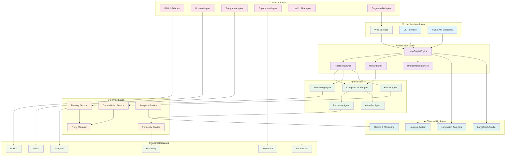

# MCP System Architecture

## 🏗️ **Arquitectura General del Sistema MCP**

El sistema MCP (Model Context Protocol) es una plataforma de orquestación de agentes autónomos que combina múltiples tecnologías para crear un runtime inteligente y observable.

---

## 📊 **Diagrama de Arquitectura Visual**



---

## 🔄 **Flujo Principal del Sistema**

### **1. Entrada del Usuario**
```
Usuario → Web DevTool / CLI / API → LangGraph Engine
```

### **2. Análisis y Razonamiento**
```
LangGraph → Reasoning Shell → Análisis de la tarea
                           → Decisión de agentes necesarios
                           → Planificación de ejecución
```

### **3. Ejecución de Agentes**
```
Reasoning Shell → Complete MCP Agent → Coordina sub-agentes
                                    → Builder Agent (construcción)
                                    → Perplexity Agent (research)
                                    → Attendee Agent (reuniones)
```

### **4. Validación y Mejora**
```
Resultado → Reward Shell → Evaluación de calidad
                        → Aplicación de contradicción
                        → Retry si es necesario
```

### **5. Observabilidad**
```
Todo el flujo → Langwatch Analytics → Métricas y trazas
             → LangGraph Studio → Visualización en tiempo real
             → Logging System → Registros detallados
```

---

## 🧩 **Componentes Principales**

### **🎨 User Interface Layer**
- **Web DevTool Client**: Cockpit visual para developers
- **CLI Interface**: Comandos de terminal para automatización
- **REST API**: Endpoints para integración externa

### **🧠 Orchestration Layer**
- **LangGraph Engine**: Motor de orquestación principal
- **Reasoning Shell**: Análisis y planificación de tareas
- **Reward Shell**: Evaluación y mejora de resultados
- **Orchestration Service**: Coordinación de servicios

### **🤖 Agent Layer**
- **Complete MCP Agent**: Agente principal que coordina todo
- **Reasoning Agent**: Especializado en análisis y razonamiento
- **Builder Agent**: Construcción de código, documentos, sitios web
- **Perplexity Agent**: Research automático con fuentes verificables
- **Attendee Agent**: Análisis de reuniones y extracción de acciones

### **⚙️ Service Layer**
- **Memory Service**: Gestión de contexto y memoria
- **Contradiction Service**: Mejora explícita de resultados
- **Retry Manager**: Manejo inteligente de reintentos
- **Perplexity Service**: Wrapper para research con fallbacks
- **Analytics Service**: Recolección y análisis de métricas

### **🔌 Adapter Layer**
- **GitHub Adapter**: Gestión de repositorios y código
- **Notion Adapter**: Base de conocimiento y documentación
- **Telegram Adapter**: Comunicación y notificaciones
- **Supabase Adapter**: Base de datos y logging
- **Local LLM Adapter**: Modelos locales (Mistral, LLaMA, DeepSeek)
- **Stagehand Adapter**: Automatización web y scraping

### **👁️ Observability Layer**
- **Langwatch Analytics**: Observabilidad completa de LLMs
- **LangGraph Studio**: Visualización y debugging de grafos
- **Logging System**: Sistema de logs estructurado
- **Metrics & Monitoring**: Métricas de rendimiento y salud

---

## 🔀 **Patrones de Flujo**

### **Flujo Simple (Task Execution)**
```
Usuario → Reasoning → Builder → Resultado
```

### **Flujo con Research**
```
Usuario → Reasoning → Perplexity → Builder → Resultado
```

### **Flujo con Contradicción**
```
Usuario → Reasoning → Builder → Reward → Contradicción → Builder → Resultado
```

### **Flujo de Reunión**
```
Audio → Attendee → Extracción → MCP Agents → Acciones Automáticas
```

### **Flujo Complejo (Multi-Agent)**
```
Usuario → Reasoning → [Perplexity + Builder + Attendee] → Orchestration → Resultado
```

---

## 🎯 **Características Únicas**

### **1. Contradicción Explícita**
- Sistema único que mejora resultados contradiciéndolos intencionalmente
- Aplicación automática cuando la calidad es insuficiente
- Aprendizaje continuo de patrones de mejora

### **2. Observabilidad Total**
- Trazabilidad completa de todas las decisiones
- Visualización en tiempo real del flujo de agentes
- Métricas detalladas de rendimiento y calidad

### **3. Adaptabilidad**
- Fallbacks automáticos entre servicios
- Selección inteligente de modelos LLM
- Escalabilidad horizontal de agentes

### **4. Integración Universal**
- Protocolo MCP estándar para interoperabilidad
- Adaptadores para cualquier servicio externo
- API REST para integración con sistemas existentes

---

## 🚀 **Ventajas Arquitecturales**

### **Modularidad**
- Cada componente es independiente y reemplazable
- Fácil adición de nuevos agentes y adaptadores
- Separación clara de responsabilidades

### **Escalabilidad**
- Procesamiento paralelo de agentes
- Distribución horizontal de carga
- Cache inteligente para optimización

### **Robustez**
- Múltiples fallbacks para cada servicio
- Manejo inteligente de errores
- Recuperación automática de fallos

### **Observabilidad**
- Visibilidad completa del sistema
- Debugging en tiempo real
- Métricas para optimización continua

---

## 🔧 **Configuración y Deployment**

### **Desarrollo Local**
```bash
# Iniciar LangGraph Studio
./langgraph_system/studio/studio.sh dev

# Iniciar Web DevTool
cd mcp-devtool-client && npm run dev

# Iniciar Backend
cd backend && npm start
```

### **Producción**
```bash
# Deploy completo
docker-compose up -d

# Monitoreo
./scripts/health-check.sh
```

### **Observabilidad**
```bash
# Langwatch Dashboard
open http://localhost:8000

# LangGraph Studio
open http://localhost:8123

# DevTool Client
open http://localhost:5173
```

---

**Esta arquitectura proporciona un runtime completo para agentes autónomos con capacidades únicas de contradicción explícita, observabilidad total y adaptabilidad universal.** 🎯

