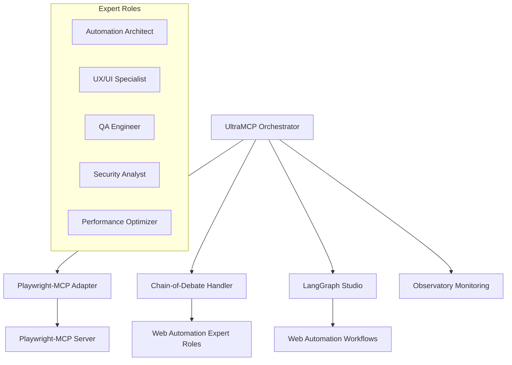

# 🎭 Playwright-MCP Integration Guide para UltraMCP

Esta guía completa documenta la integración de Playwright-MCP en el ecosistema UltraMCP, proporcionando capacidades avanzadas de automatización web con análisis inteligente mediante Chain-of-Debate Protocol.

## 📋 Índice

1. [Visión General](#visión-general)
2. [Arquitectura de Integración](#arquitectura-de-integración)
3. [Casos de Uso Específicos](#casos-de-uso-específicos)
4. [Implementación Técnica](#implementación-técnica)
5. [Workflows Inteligentes](#workflows-inteligentes)
6. [Chain-of-Debate para Web Automation](#chain-of-debate-para-web-automation)
7. [Ejemplos Prácticos](#ejemplos-prácticos)
8. [Configuración y Deployment](#configuración-y-deployment)
9. [Monitoreo y Observabilidad](#monitoreo-y-observabilidad)
10. [Troubleshooting](#troubleshooting)

## 🎯 Visión General

### ¿Qué es esta Integración?

La integración Playwright-MCP en UltraMCP combina:

- **Playwright-MCP Server**: Capacidades de automatización web basadas en Playwright
- **UltraMCP Orchestration**: Orquestación inteligente multi-LLM
- **Chain-of-Debate Protocol**: Análisis colaborativo para estrategias óptimas
- **LangGraph Workflows**: Flujos de trabajo complejos y adaptativos

### Beneficios Clave

✅ **Automatización Web Inteligente**: Decisiones automáticas basadas en análisis multi-experto
✅ **Workflows Adaptativos**: Flujos que se ajustan según el contexto y resultados
✅ **Observabilidad Completa**: Monitoreo detallado con LangWatch integration
✅ **Escalabilidad Enterprise**: Diseñado para entornos de producción
✅ **Recuperación de Errores**: Manejo inteligente de fallos y estrategias alternativas

## 🏗️ Arquitectura de Integración

### Componentes Principales



### Flujo de Datos

1. **Solicitud de Usuario** → UltraMCP Orchestrator
2. **Análisis de Tarea** → Chain-of-Debate Protocol
3. **Debate Multi-Experto** → Estrategia Óptima
4. **Ejecución Workflow** → LangGraph + Playwright-MCP
5. **Monitoreo y Logging** → Observatory + LangWatch

## 🎨 Casos de Uso Específicos

### 1. E-commerce Intelligence

**Descripción**: Monitoreo automático de productos, precios y competencia

**Capacidades**:
- Búsqueda automática de productos
- Extracción de precios y disponibilidad
- Comparación competitiva
- Alertas de cambios de precio

**Workflow Ejemplo**:
```python
context = WebAutomationDebateContext(
    task="Monitor iPhone 15 prices across top 5 e-commerce sites",
    target_url="https://amazon.com",
    available_tools=["navigate", "search", "extract", "screenshot"],
    constraints={"max_time": 300, "respect_robots": True},
    user_requirements={
        "sites": ["amazon.com", "ebay.com", "bestbuy.com"],
        "extract_format": "structured_json",
        "include_images": True
    }
)
```

### 2. Social Media Management

**Descripción**: Automatización de posting y engagement en redes sociales

**Capacidades**:
- Programación de posts automáticos
- Respuesta a comentarios/mensajes
- Análisis de engagement
- Reporting automático

**Workflow Ejemplo**:
```python
context = WebAutomationDebateContext(
    task="Post daily content to LinkedIn with optimal timing",
    target_url="https://linkedin.com",
    available_tools=["navigate", "login", "post", "schedule"],
    constraints={"auth_required": True, "rate_limits": True},
    user_requirements={
        "content_type": "professional_updates",
        "optimal_timing": True,
        "engagement_tracking": True
    }
)
```

### 3. Financial Data Aggregation

**Descripción**: Recopilación automática de datos financieros y análisis

**Capacidades**:
- Extracción de datos de mercado
- Análisis de tendencias
- Generación de reportes
- Alertas de cambios significativos

**Workflow Ejemplo**:
```python
context = WebAutomationDebateContext(
    task="Aggregate crypto prices and generate daily market report",
    target_url="https://coinmarketcap.com",
    available_tools=["navigate", "extract", "analyze", "report"],
    constraints={"real_time": True, "accuracy_critical": True},
    user_requirements={
        "currencies": ["BTC", "ETH", "ADA", "SOL"],
        "metrics": ["price", "volume", "market_cap", "change_24h"],
        "report_format": "pdf_dashboard"
    }
)
```

### 4. Quality Assurance Testing

**Descripción**: Testing automático de aplicaciones web

**Capacidades**:
- Tests de regresión automáticos
- Validación de UI/UX
- Performance testing
- Accessibility compliance

**Workflow Ejemplo**:
```python
context = WebAutomationDebateContext(
    task="Execute comprehensive QA test suite for web application",
    target_url="https://staging.myapp.com",
    available_tools=["navigate", "interact", "validate", "screenshot"],
    constraints={"test_coverage": 95, "performance_threshold": "2s"},
    user_requirements={
        "test_types": ["functional", "ui", "performance", "accessibility"],
        "browsers": ["chrome", "firefox", "safari"],
        "report_failures": True
    }
)
```

### 5. Lead Generation Intelligence

**Descripción**: Identificación y calificación automática de leads

**Capacidades**:
- Prospección automática
- Enriquecimiento de datos
- Scoring de leads
- CRM integration

**Workflow Ejemplo**:
```python
context = WebAutomationDebateContext(
    task="Research and qualify B2B leads in tech industry",
    target_url="https://linkedin.com/sales",
    available_tools=["search", "profile_analysis", "contact_extraction"],
    constraints={"compliance": "GDPR", "rate_limits": True},
    user_requirements={
        "industry": "SaaS",
        "company_size": "50-500",
        "location": "North America",
        "scoring_criteria": "budget_authority_need_timeline"
    }
)
```

## 🔧 Implementación Técnica

### Configuración del Adapter

```javascript
// apps/backend/src/adapters/playwrightMCPAdapter.js
class PlaywrightMCPAdapter extends BaseMCPAdapter {
  constructor(config = {}) {
    super(config);
    this.serverCommand = config.serverCommand || ["npx", "playwright-mcp"];
    this.timeout = config.timeout || 30000;
    this.headless = config.headless !== false;
  }
  
  async executeAction(toolId, params) {
    const toolName = toolId.split("/")[1];
    return await this._call_playwright_mcp(toolName, params);
  }
}
```

### Registro en UltraMCP

```sql
-- Registro en base de datos
INSERT INTO adapter_registrations (
  adapter_id, adapter_name, adapter_class, config, enabled
) VALUES (
  'playwright-mcp', 
  'Playwright MCP Adapter', 
  'PlaywrightMCPAdapter',
  '{
    "serverCommand": ["npx", "playwright-mcp"],
    "timeout": 30000,
    "headless": true,
    "retryAttempts": 3
  }'::jsonb,
  true
);
```

### Configuración de Tools

```json
{
  "playwright-mcp/navigate": {
    "name": "Web Navigation",
    "description": "Navigate to URLs with smart waiting",
    "parameters": {
      "url": "string",
      "waitFor": "load|networkidle|domcontentloaded"
    }
  },
  "playwright-mcp/extract": {
    "name": "Data Extraction", 
    "description": "Extract structured data with JSON schema",
    "parameters": {
      "schema": "object",
      "selector": "string (optional)"
    }
  },
  "playwright-mcp/interact": {
    "name": "Element Interaction",
    "description": "Click, type, and interact with elements",
    "parameters": {
      "action": "click|type|hover|scroll",
      "selector": "string",
      "value": "string (for type action)"
    }
  }
}
```

## 🧠 Workflows Inteligentes

### LangGraph Web Automation Agent

```python
from services.langgraph_studio.agents.web_automation_agent import create_web_automation_workflow

# Crear workflow inteligente
workflow = create_web_automation_workflow()

# Estado inicial
initial_state = WebAutomationState(
    task="Extract product reviews from Amazon",
    url="https://amazon.com/product/B08XYZ",
    workflow_plan=[],
    current_step=0,
    session_id="session_001"
)

# Ejecutar workflow
result = workflow.invoke(initial_state)
```

### Nodos Especializados

```python
# Nodo de análisis de tareas
def task_analyzer_node(state: WebAutomationState):
    # Análisis inteligente de la tarea
    workflow_plan = analyze_and_plan_workflow(state["task"], state["url"])
    state["workflow_plan"] = workflow_plan
    return state

# Nodo de ejecución de pasos
def step_executor_node(state: WebAutomationState):
    current_step = state["workflow_plan"][state["current_step"]]
    result = execute_playwright_action(current_step)
    state["step_results"].append(result)
    state["current_step"] += 1
    return state

# Nodo de validación
def result_validator_node(state: WebAutomationState):
    success_rate = calculate_success_rate(state["step_results"])
    state["final_result"] = compile_final_report(state)
    return state
```

## 🤝 Chain-of-Debate para Web Automation

### Expert Roles

#### 1. Automation Architect
- **Expertise**: Estrategia general y diseño de workflows
- **Enfoque**: Escalabilidad, mantenibilidad, patrones robustos

#### 2. UX/UI Specialist  
- **Expertise**: Patrones de interacción y identificación de elementos
- **Enfoque**: Selectores confiables, timing de interacciones

#### 3. QA Engineer
- **Expertise**: Testing, validación y aseguramiento de calidad
- **Enfoque**: Confiabilidad, casos edge, manejo de errores

#### 4. Security Analyst
- **Expertise**: Implicaciones de seguridad y prácticas seguras
- **Enfoque**: Riesgos de seguridad, protección de datos

#### 5. Performance Optimizer
- **Expertise**: Optimización de rendimiento y eficiencia
- **Enfoque**: Velocidad, uso de recursos, optimización

### Proceso de Debate

```python
# Iniciar debate para estrategia web automation
debate_session = await cod_handler.initiate_web_automation_debate(
    context=context,
    debate_rounds=3
)

# Ronda 1: Propuestas iniciales
initial_proposals = await gather_initial_proposals(context)

# Ronda 2-3: Debate y refinamiento
for round_num in range(2, 4):
    debate_round = await conduct_debate_round(
        context, proposals, round_num
    )
    proposals = refine_proposals_based_on_critiques(proposals, debate_round)

# Consenso final
consensus = await reach_consensus(context, proposals, debate_history)
selected_strategy = consensus["selected_strategy"]
```

### Resultado del Debate

```json
{
  "consensus": {
    "selected_strategy": {
      "strategy_type": "optimized_multi_step",
      "confidence": 0.92,
      "approach": "Hybrid approach combining direct interaction with smart waiting",
      "steps": [
        {
          "action": "navigate",
          "params": {"url": "target_url", "waitFor": "networkidle"},
          "reasoning": "Ensures all dynamic content is loaded"
        },
        {
          "action": "smart_extract", 
          "params": {"schema": "adaptive_schema", "fallback_selectors": ["css", "xpath", "text"]},
          "reasoning": "Multi-selector strategy increases success rate"
        }
      ]
    },
    "risk_factors": ["Dynamic content loading", "Rate limiting"],
    "success_probability": 0.94,
    "fallback_strategies": ["Simplified direct approach", "Retry with different selectors"]
  }
}
```

## 📊 Ejemplos Prácticos

### Ejemplo 1: E-commerce Product Research

```python
# Configuración del contexto
context = WebAutomationDebateContext(
    task="Research competitor prices for iPhone 15 across top e-commerce sites",
    target_url="https://amazon.com",
    available_tools=["navigate", "search", "extract", "screenshot", "compare"],
    constraints={
        "max_execution_time": 600,  # 10 minutes
        "respect_rate_limits": True,
        "data_accuracy": "high"
    },
    user_requirements={
        "sites": ["amazon.com", "bestbuy.com", "target.com"],
        "product": "iPhone 15 128GB",
        "data_points": ["price", "availability", "shipping", "reviews"],
        "output_format": "comparative_report"
    }
)

# Ejecutar workflow CoD-enhanced
debate_result = await cod_handler.initiate_web_automation_debate(context)
selected_strategy = debate_result["consensus"]["selected_strategy"]

# Implementar estrategia seleccionada
workflow_result = await execute_cod_strategy(selected_strategy, context)
```

### Ejemplo 2: Social Media Content Automation

```python
# Configuración para posting automático
context = WebAutomationDebateContext(
    task="Create and schedule weekly LinkedIn content for tech company",
    target_url="https://linkedin.com/company/our-company",
    available_tools=["navigate", "authenticate", "compose", "schedule", "analyze"],
    constraints={
        "posting_frequency": "daily",
        "content_quality": "professional",
        "engagement_optimization": True
    },
    user_requirements={
        "content_types": ["industry_insights", "company_updates", "thought_leadership"],
        "optimal_timing": True,
        "hashtag_strategy": "auto_suggest",
        "visual_content": "auto_generate"
    }
)

# Análisis CoD para estrategia de contenido
content_strategy = await cod_handler.initiate_web_automation_debate(context)

# Workflow de ejecución
content_workflow = create_social_media_automation_workflow()
result = await content_workflow.invoke({
    "strategy": content_strategy["consensus"]["selected_strategy"],
    "context": context
})
```

### Ejemplo 3: QA Testing Automation

```python
# Configuración para testing automático
context = WebAutomationDebateContext(
    task="Execute comprehensive QA testing for web application release",
    target_url="https://staging.myapp.com",
    available_tools=["navigate", "interact", "validate", "screenshot", "performance"],
    constraints={
        "test_coverage": 95,
        "execution_time_limit": 3600,  # 1 hour
        "browser_compatibility": ["chrome", "firefox", "safari"]
    },
    user_requirements={
        "test_suites": ["functional", "ui", "performance", "accessibility"],
        "failure_handling": "capture_evidence",
        "reporting": "detailed_html_report",
        "integration": "jira_ticket_creation"
    }
)

# Debate para estrategia de testing óptima
testing_strategy = await cod_handler.initiate_web_automation_debate(context)

# Ejecutar tests con estrategia seleccionada
qa_workflow = create_qa_testing_workflow()
test_results = await qa_workflow.invoke({
    "strategy": testing_strategy["consensus"]["selected_strategy"],
    "test_context": context
})
```

## ⚙️ Configuración y Deployment

### Prerequisitos

```bash
# Instalar Playwright-MCP
npm install -g playwright-mcp

# Instalar browsers de Playwright
npx playwright install

# Configurar UltraMCP environment
cp .env.example .env
# Editar .env con configuraciones específicas
```

### Variables de Entorno

```bash
# Playwright-MCP Configuration
PLAYWRIGHT_HEADLESS=true
PLAYWRIGHT_TIMEOUT=30000
PLAYWRIGHT_BROWSER=chromium

# UltraMCP Integration
MCP_PLAYWRIGHT_ENABLED=true
MCP_PLAYWRIGHT_RETRY_ATTEMPTS=3
MCP_PLAYWRIGHT_MAX_CONCURRENT=5

# Chain-of-Debate Configuration
COD_ENABLED=true
COD_DEBATE_ROUNDS=3
COD_EXPERT_TIMEOUT=120

# Monitoring and Observability
LANGWATCH_ENABLED=true
LANGWATCH_PROJECT_ID=ultramcp-web-automation
OBSERVATORY_ENABLED=true
```

### Docker Configuration

```yaml
# docker-compose.playwright.yml
version: '3.8'
services:
  ultramcp-playwright:
    build:
      context: .
      dockerfile: Dockerfile.playwright
    environment:
      - PLAYWRIGHT_HEADLESS=true
      - MCP_BASE_URL=http://ultramcp-backend:3000
    volumes:
      - ./screenshots:/app/screenshots
      - ./downloads:/app/downloads
    networks:
      - ultramcp-network
    depends_on:
      - ultramcp-backend
      - playwright-mcp-server

  playwright-mcp-server:
    image: playwright-mcp:latest
    ports:
      - "9001:9001"
    environment:
      - MCP_PORT=9001
      - PLAYWRIGHT_BROWSERS_PATH=/ms-playwright
    volumes:
      - playwright-data:/ms-playwright
    networks:
      - ultramcp-network

volumes:
  playwright-data:

networks:
  ultramcp-network:
    external: true
```

### Deployment Scripts

```bash
#!/bin/bash
# deploy-playwright-integration.sh

echo "🎭 Deploying Playwright-MCP Integration..."

# Build and start services
docker-compose -f docker-compose.yml -f docker-compose.playwright.yml up -d

# Wait for services to be ready
echo "⏳ Waiting for services to initialize..."
sleep 30

# Test integration
echo "🧪 Testing Playwright-MCP integration..."
curl -X POST http://localhost:3000/api/mcp/execute \
  -H "Content-Type: application/json" \
  -d '{
    "toolId": "playwright-mcp/navigate",
    "params": {"url": "https://example.com"}
  }'

echo "✅ Deployment completed!"
```

## 📈 Monitoreo y Observabilidad

### Métricas Clave

1. **Execution Metrics**
   - Success rate por workflow
   - Tiempo promedio de ejecución
   - Errores por tipo y frecuencia
   - Resource utilization

2. **Quality Metrics**
   - Data extraction accuracy
   - Screenshot quality scores
   - Element detection reliability
   - Workflow completion rates

3. **Performance Metrics**
   - Page load times
   - Action execution times
   - Memory usage per session
   - Concurrent session capacity

4. **Business Metrics**
   - Tasks completed per hour
   - Cost per automation
   - ROI de automatización
   - User satisfaction scores

### Dashboard de Observatory

```javascript
// Observatory dashboard configuration
const playwrightMetrics = {
  name: "Playwright-MCP Automation",
  panels: [
    {
      title: "Execution Success Rate",
      type: "gauge",
      query: "playwright_execution_success_rate",
      thresholds: [
        { value: 95, color: "green" },
        { value: 85, color: "yellow" },
        { value: 0, color: "red" }
      ]
    },
    {
      title: "Active Workflows",
      type: "stat",
      query: "count(playwright_active_workflows)"
    },
    {
      title: "Average Execution Time",
      type: "time-series",
      query: "avg(playwright_execution_duration_seconds)"
    },
    {
      title: "Error Distribution",
      type: "pie-chart", 
      query: "sum by (error_type) (playwright_errors_total)"
    }
  ]
}
```

### LangWatch Integration

```python
# Configuración de trazas para LangWatch
import langwatch

@langwatch.trace
async def execute_web_automation_workflow(context: WebAutomationDebateContext):
    """Execute web automation with full observability"""
    
    with langwatch.span("cod_analysis") as span:
        span.set_attribute("task", context.task)
        span.set_attribute("target_url", context.target_url)
        
        debate_result = await cod_handler.initiate_web_automation_debate(context)
        span.set_attribute("consensus_confidence", debate_result["consensus"]["confidence_score"])
    
    with langwatch.span("workflow_execution") as span:
        workflow_result = await execute_playwright_workflow(debate_result["consensus"]["selected_strategy"])
        span.set_attribute("success_rate", workflow_result["execution_metrics"]["success_rate"])
        
    return workflow_result
```

## 🔧 Troubleshooting

### Problemas Comunes

#### 1. Playwright-MCP Server No Responde

**Síntomas**: Timeouts en llamadas a herramientas

**Soluciones**:
```bash
# Verificar proceso del servidor
ps aux | grep playwright-mcp

# Restart del servidor
pkill -f playwright-mcp
npx playwright-mcp --port 9001

# Verificar logs
tail -f /var/log/playwright-mcp.log
```

#### 2. Elementos No Encontrados

**Síntomas**: Errores de "element not found" frecuentes

**Soluciones**:
```python
# Usar selectores más robustos
selectors = [
    'button[data-testid="submit"]',  # Preferred: data attributes
    'button:has-text("Submit")',     # Fallback: text content
    'button.submit-btn',             # Last resort: CSS classes
]

# Implementar wait strategies
await page.wait_for_selector(selector, state="visible", timeout=30000)
```

#### 3. Performance Issues

**Síntomas**: Workflows lentos o que consumen muchos recursos

**Soluciones**:
```javascript
// Optimizar configuración de Playwright
const playwrightConfig = {
  headless: true,
  args: [
    '--no-sandbox',
    '--disable-setuid-sandbox', 
    '--disable-background-timer-throttling',
    '--disable-renderer-backgrounding'
  ],
  launchOptions: {
    timeout: 30000,
    slowMo: 0  // Remove delays in headless mode
  }
}
```

#### 4. CoD Analysis Timeout

**Síntomas**: Chain-of-Debate tarda demasiado en alcanzar consenso

**Soluciones**:
```python
# Reducir rounds de debate para casos simples
if task_complexity < 0.5:
    debate_rounds = 1
elif task_complexity < 0.8:
    debate_rounds = 2
else:
    debate_rounds = 3

# Usar cached strategies para tareas similares
strategy_cache = get_cached_strategy(task_signature)
if strategy_cache and strategy_cache.confidence > 0.9:
    return strategy_cache
```

### Logs y Debugging

```bash
# Habilitar debug logging
export DEBUG=playwright:*,ultramcp:*,cod:*

# Logs detallados de Playwright
export PLAYWRIGHT_DEBUG=1

# Capturar screenshots en errores
export PLAYWRIGHT_CAPTURE_ON_ERROR=true
```

### Health Checks

```python
async def health_check_playwright_integration():
    """Comprehensive health check for Playwright-MCP integration"""
    
    checks = {
        "playwright_server": await check_playwright_server(),
        "mcp_adapter": await check_mcp_adapter_registration(),
        "cod_service": await check_cod_service(),
        "workflows": await check_langgraph_workflows(),
        "observatory": await check_observatory_connection()
    }
    
    overall_health = all(checks.values())
    
    return {
        "healthy": overall_health,
        "checks": checks,
        "timestamp": datetime.now().isoformat()
    }
```

## 🚀 Próximos Pasos y Roadmap

### Fase 1: Core Integration (Completado)
- ✅ Playwright-MCP Adapter implementado
- ✅ LangGraph workflows creados
- ✅ Chain-of-Debate integration
- ✅ Observabilidad básica

### Fase 2: Enhanced Intelligence (En Progreso)
- 🔄 Advanced CoD strategies
- 🔄 Machine learning para pattern recognition
- 🔄 Adaptive workflow optimization
- 🔄 Enhanced error recovery

### Fase 3: Enterprise Features (Planificado)
- 📋 Multi-tenant isolation
- 📋 Advanced security features
- 📋 Compliance frameworks
- 📋 Enterprise integration APIs

### Fase 4: AI-Native Capabilities (Futuro)
- 📋 Visual AI para element detection
- 📋 Natural language to automation
- 📋 Predictive failure detection
- 📋 Auto-healing workflows

---

## 📞 Soporte y Contribución

### Documentación Adicional
- [UltraMCP Core Documentation](../README.md)
- [Chain-of-Debate Protocol Guide](../services/chain-of-debate/README.md)
- [LangGraph Studio Guide](../services/langgraph-studio/README.md)

### Comunidad y Soporte
- GitHub Issues: Para reportar bugs y solicitar features
- Discord: Para discusiones y soporte de la comunidad
- Documentation: Para guías detalladas y tutorials

Esta integración representa el estado del arte en automatización web inteligente, combinando la potencia de Playwright con la inteligencia colaborativa del Chain-of-Debate Protocol en el ecosistema UltraMCP. 🎭✨