# LangGraph Studio Flow Documentation

## 🎬 **LangGraph Studio - Visualización y Debugging en Tiempo Real**

LangGraph Studio es la herramienta de visualización y debugging que proporciona observabilidad completa del sistema MCP, permitiendo ver el flujo de agentes en tiempo real y debuggear problemas complejos.

---

## 🚀 **Inicio Rápido**

### **Lanzar LangGraph Studio:**
```bash
# Desde el directorio del proyecto
./langgraph_system/studio/studio.sh start

# O en modo desarrollo con hot reload
./langgraph_system/studio/studio.sh dev

# Para debugging avanzado
./langgraph_system/studio/studio.sh debug
```

### **Acceso Web:**
- **Dashboard Principal**: http://localhost:8123
- **API Documentation**: http://localhost:8123/docs
- **WebSocket Debug**: ws://localhost:8124

---

## 📊 **Dashboard Principal**

### **Vista General del Sistema**
```
┌─────────────────────────────────────────────────────────────┐
│ 🎯 MCP System - LangGraph Studio                           │
├─────────────────────────────────────────────────────────────┤
│                                                             │
│ 📊 System Status: ● ACTIVE    🔄 Sessions: 3              │
│ ⚡ Avg Response: 1.2s         🎯 Success Rate: 94%         │
│                                                             │
│ ┌─────────────────┐ ┌─────────────────┐ ┌─────────────────┐ │
│ │ 🧠 Reasoning    │ │ 🏗️ Builder      │ │ 🔍 Perplexity   │ │
│ │ Status: Active  │ │ Status: Active  │ │ Status: Active  │ │
│ │ Queue: 2 tasks  │ │ Queue: 1 task   │ │ Queue: 0 tasks  │ │
│ │ Avg Time: 0.8s  │ │ Avg Time: 2.1s  │ │ Avg Time: 3.2s  │ │
│ └─────────────────┘ └─────────────────┘ └─────────────────┘ │
│                                                             │
│ ┌─────────────────┐ ┌─────────────────┐ ┌─────────────────┐ │
│ │ 🎧 Attendee     │ │ 🔄 Retry Mgr    │ │ 📊 Analytics    │ │
│ │ Status: Idle    │ │ Status: Active  │ │ Status: Active  │ │
│ │ Queue: 0 tasks  │ │ Retries: 3      │ │ Events: 1,247   │ │
│ │ Avg Time: 1.5s  │ │ Success: 89%    │ │ Errors: 12      │ │
│ └─────────────────┘ └─────────────────┘ └─────────────────┘ │
└─────────────────────────────────────────────────────────────┘
```

**Elementos del Dashboard:**
- **System Status**: Estado general del sistema (Active/Idle/Error)
- **Live Metrics**: Métricas en tiempo real (sesiones, respuesta, éxito)
- **Agent Cards**: Estado individual de cada agente
- **Queue Information**: Tareas pendientes por agente
- **Performance Metrics**: Tiempos promedio y tasas de éxito

---

## 🔄 **Visualización de Flujo en Tiempo Real**

### **Grafo de Ejecución Activa**
```
┌─────────────────────────────────────────────────────────────┐
│ 🔄 Active Execution Flow - Session: abc123                 │
├─────────────────────────────────────────────────────────────┤
│                                                             │
│     👤 User Input                                          │
│         │                                                   │
│         ▼                                                   │
│     🧠 Reasoning Agent ✅ (0.8s)                           │
│         │                                                   │
│         ├─── 🔍 Perplexity Agent ⏳ (2.1s)                │
│         │                                                   │
│         └─── 🏗️ Builder Agent ⏸️ (waiting)                │
│                   │                                         │
│                   ▼                                         │
│               🔄 Reward Shell ⏸️ (pending)                 │
│                   │                                         │
│                   ▼                                         │
│               📤 Final Result ⏸️ (pending)                 │
│                                                             │
│ Legend: ✅ Completed  ⏳ Running  ⏸️ Pending  ❌ Error     │
└─────────────────────────────────────────────────────────────┘
```

**Estados de Nodos:**
- **✅ Completed**: Nodo ejecutado exitosamente
- **⏳ Running**: Nodo en ejecución actual
- **⏸️ Pending**: Nodo esperando ejecución
- **❌ Error**: Nodo falló, requiere atención
- **🔄 Retry**: Nodo siendo reintentado

### **Detalles de Nodo en Tiempo Real**
```
┌─────────────────────────────────────────────────────────────┐
│ 🔍 Perplexity Agent - Node Details                         │
├─────────────────────────────────────────────────────────────┤
│                                                             │
│ Status: ⏳ Running (2.1s elapsed)                          │
│ Strategy: headless_browser                                  │
│ Query: "Latest AI trends 2024"                             │
│                                                             │
│ 📊 Progress:                                               │
│ ████████████████████████████████████████████████████░░░░░░ │
│ Browser initialized ✅                                     │
│ Navigation complete ✅                                     │
│ Search submitted ✅                                        │
│ Waiting for results... ⏳                                 │
│                                                             │
│ 📈 Real-time Metrics:                                      │
│ • Memory Usage: 45MB                                       │
│ • Network Requests: 12                                     │
│ • Cache Hits: 3                                            │
│                                                             │
└─────────────────────────────────────────────────────────────┘
```

---

## 🐛 **Debugging Avanzado**

### **Trace Viewer**
```
┌─────────────────────────────────────────────────────────────┐
│ 🔍 Execution Trace - Session: abc123                       │
├─────────────────────────────────────────────────────────────┤
│                                                             │
│ 📅 2024-06-18 19:45:23.123                                │
│ ├─ 👤 User: "Create landing page for AI startup"          │
│ │                                                           │
│ 📅 2024-06-18 19:45:23.145                                │
│ ├─ 🧠 Reasoning: Analyzing task complexity...              │
│ │  └─ Decision: Requires research + building               │
│ │                                                           │
│ 📅 2024-06-18 19:45:23.892                                │
│ ├─ 🔍 Perplexity: Searching "AI startup trends 2024"      │
│ │  ├─ Strategy: headless_browser                           │
│ │  ├─ Found 8 sources                                      │
│ │  └─ Confidence: 0.89                                     │
│ │                                                           │
│ 📅 2024-06-18 19:45:26.234                                │
│ ├─ 🏗️ Builder: Creating React landing page...             │
│ │  ├─ Using research insights                              │
│ │  ├─ Generated 5 components                               │
│ │  └─ Status: In progress...                               │
│                                                             │
└─────────────────────────────────────────────────────────────┘
```

### **Error Analysis**
```
┌─────────────────────────────────────────────────────────────┐
│ ❌ Error Analysis - Node: Perplexity Agent                 │
├─────────────────────────────────────────────────────────────┤
│                                                             │
│ Error Type: TimeoutError                                    │
│ Timestamp: 2024-06-18 19:45:28.567                        │
│ Duration: 5.4s (exceeded 5s timeout)                       │
│                                                             │
│ 📊 Error Context:                                          │
│ • Strategy: headless_browser                               │
│ • Query: "Complex technical analysis"                      │
│ • Browser Status: Responsive                               │
│ • Network: Slow response from perplexity.ai               │
│                                                             │
│ 🔄 Retry Strategy:                                         │
│ • Attempt 1: headless_browser (failed)                    │
│ • Attempt 2: serper_deepseek (queued)                     │
│ • Fallback: arxiv_search (available)                      │
│                                                             │
│ 🛠️ Suggested Actions:                                      │
│ • Increase timeout to 10s                                 │
│ • Switch to serper_deepseek strategy                      │
│ • Check network connectivity                              │
│                                                             │
└─────────────────────────────────────────────────────────────┘
```

---

## 📊 **Métricas y Analytics**

### **Performance Dashboard**
```
┌─────────────────────────────────────────────────────────────┐
│ 📊 Performance Metrics - Last 24 Hours                     │
├─────────────────────────────────────────────────────────────┤
│                                                             │
│ 🎯 Overall Success Rate: 94.2%                            │
│ ⚡ Average Response Time: 1.8s                             │
│ 🔄 Total Executions: 1,247                                │
│ ❌ Failed Executions: 72                                   │
│                                                             │
│ 📈 Response Time Trend:                                    │
│ 4s ┤                                                       │
│ 3s ┤     ●                                                 │
│ 2s ┤   ● ● ●   ●                                           │
│ 1s ┤ ● ● ● ● ● ● ● ●                                       │
│ 0s └─────────────────────────────────────────────────────── │
│    00:00  06:00  12:00  18:00  24:00                      │
│                                                             │
│ 🤖 Agent Performance:                                      │
│ • Reasoning Agent:   98.1% success, 0.8s avg              │
│ • Builder Agent:     91.3% success, 2.1s avg              │
│ • Perplexity Agent:  89.7% success, 3.2s avg              │
│ • Attendee Agent:    96.4% success, 1.5s avg              │
│                                                             │
└─────────────────────────────────────────────────────────────┘
```

### **Contradiction Analysis**
```
┌─────────────────────────────────────────────────────────────┐
│ 🔥 Contradiction Effectiveness Analysis                     │
├─────────────────────────────────────────────────────────────┤
│                                                             │
│ 📊 Contradiction Stats (Last 7 Days):                     │
│ • Total Contradictions Applied: 156                        │
│ • Successful Improvements: 142 (91.0%)                     │
│ • Average Quality Increase: +23%                           │
│ • Most Effective Level: Moderate (67% of cases)            │
│                                                             │
│ 🎯 Contradiction Triggers:                                 │
│ • Low Quality Score (<0.7): 89 cases                      │
│ • User Feedback: 34 cases                                  │
│ • Automatic Detection: 33 cases                            │
│                                                             │
│ 📈 Quality Improvement Distribution:                       │
│ 50%+ improvement: ████████████████████████████████ 45%     │
│ 25-50% improvement: ████████████████████ 32%               │
│ 10-25% improvement: ████████████ 18%                       │
│ <10% improvement: ███ 5%                                   │
│                                                             │
│ 🧠 Learning Patterns:                                      │
│ • Code quality: Moderate contradiction most effective      │
│ • Documentation: Mild contradiction preferred              │
│ • Research: Extreme contradiction for depth                │
│                                                             │
└─────────────────────────────────────────────────────────────┘
```

---

## 🔧 **Herramientas de Debugging**

### **Session Replay**
```bash
# Reproducir sesión específica
./langgraph_system/studio/studio.sh replay session_abc123

# Reproducir con modificaciones
./langgraph_system/studio/studio.sh replay session_abc123 --modify-input
```

### **Breakpoints y Step-through**
```
┌─────────────────────────────────────────────────────────────┐
│ 🔍 Debug Session - Breakpoint Active                       │
├─────────────────────────────────────────────────────────────┤
│                                                             │
│ Current Node: 🏗️ Builder Agent                            │
│ Breakpoint: Before code generation                         │
│                                                             │
│ 📊 Current State:                                          │
│ {                                                           │
│   "task": "Create React component",                        │
│   "research_data": {...},                                  │
│   "requirements": [...],                                    │
│   "context": {...}                                         │
│ }                                                           │
│                                                             │
│ 🛠️ Debug Actions:                                          │
│ [C] Continue execution                                      │
│ [S] Step into next node                                     │
│ [M] Modify state                                            │
│ [I] Inspect variables                                       │
│ [R] Restart from this point                                │
│                                                             │
└─────────────────────────────────────────────────────────────┘
```

### **Live Variable Inspection**
```
┌─────────────────────────────────────────────────────────────┐
│ 🔍 Variable Inspector - Builder Agent                      │
├─────────────────────────────────────────────────────────────┤
│                                                             │
│ 📊 Input Variables:                                        │
│ • task: "Create landing page"                              │
│ • research_data: Object (8 properties)                     │
│   ├─ trends: Array[5]                                      │
│   ├─ competitors: Array[3]                                 │
│   └─ best_practices: Array[7]                              │
│ • requirements: Array[4]                                    │
│ • context: Object (12 properties)                          │
│                                                             │
│ 🔄 Processing State:                                       │
│ • current_step: "component_generation"                     │
│ • progress: 0.65 (65% complete)                            │
│ • generated_files: Array[3]                                │
│   ├─ "App.jsx" (2.1KB)                                    │
│   ├─ "Header.jsx" (0.8KB)                                 │
│   └─ "Hero.jsx" (1.3KB)                                   │
│                                                             │
│ 📤 Output Preview:                                         │
│ • estimated_completion: 30s                                │
│ • quality_score: 0.87                                      │
│ • files_to_generate: 2 remaining                           │
│                                                             │
└─────────────────────────────────────────────────────────────┘
```

---

## 📈 **Exportación y Reporting**

### **Generar Reportes**
```bash
# Reporte de rendimiento
./langgraph_system/studio/studio.sh export --type performance --period 7d

# Reporte de errores
./langgraph_system/studio/studio.sh export --type errors --format json

# Diagrama de flujo para presentación
./langgraph_system/studio/studio.sh export --type flow --format mermaid
```

### **Exportación de Grafos**
```bash
# Exportar grafo actual
./langgraph_system/studio/studio.sh export

# Archivos generados:
# ├─ studio_exports/
# │  ├─ mcp_graph.mmd (Mermaid diagram)
# │  ├─ mcp_graph_pitch_deck.mmd (Simplified)
# │  ├─ system_metrics.json
# │  ├─ performance_report.html
# │  └─ export_manifest.json
```

### **Integración con Presentaciones**
```markdown
# Diagrama generado automáticamente para pitch deck:

```mermaid
graph LR
    User[👤 User] --> Reasoning[🧠 Reasoning]
    Reasoning --> Research[🔍 Research]
    Reasoning --> Builder[🏗️ Builder]
    Research --> Builder
    Builder --> Reward[🔄 Reward]
    Reward --> Result[📤 Result]
```



**Métricas del Sistema:**
- Success Rate: 94.2%
- Avg Response: 1.8s
- Contradictions Applied: 156
- Quality Improvement: +23%
```

---

## 🎯 **Casos de Uso Avanzados**

### **Debugging de Flujo Complejo**
1. **Identificar Bottleneck**: Ver qué agente toma más tiempo
2. **Analizar Fallos**: Revisar patrones de error
3. **Optimizar Rutas**: Ajustar conditional logic
4. **Validar Mejoras**: Comparar métricas antes/después

### **Monitoreo de Producción**
1. **Alertas Automáticas**: Configurar umbrales de error
2. **Health Checks**: Verificación continua de agentes
3. **Capacity Planning**: Análisis de carga y escalabilidad
4. **Performance Tuning**: Optimización basada en métricas

### **Desarrollo y Testing**
1. **Unit Testing**: Probar nodos individuales
2. **Integration Testing**: Validar flujos completos
3. **Load Testing**: Simular carga alta
4. **A/B Testing**: Comparar diferentes estrategias

---

## 🔗 **Integración con Herramientas Externas**

### **Langwatch Integration**
- **Automatic Sync**: Métricas sincronizadas automáticamente
- **Unified Dashboard**: Vista combinada de LangGraph + Langwatch
- **Cross-Reference**: Links entre trazas y ejecuciones

### **DevTool Client Integration**
- **Embedded Studio**: LangGraph Studio dentro del DevTool
- **Real-time Updates**: Actualizaciones en tiempo real
- **Shared State**: Estado compartido entre herramientas

---

**LangGraph Studio proporciona observabilidad completa y capacidades de debugging avanzadas que hacen del sistema MCP una plataforma transparente y optimizable para agentes autónomos.** 🎯

