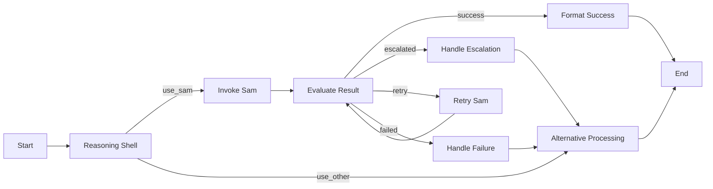

# Sam MCP Tool Integration - Complete LangGraph Implementation

## Overview

Sam has been fully integrated as an MCP Tool within the UltraMCP LangGraph ecosystem. This integration provides autonomous task execution capabilities with complete typed schema definitions, local LLM priority, and seamless integration with the existing UltraMCP infrastructure.

## LangGraph Tool Definition

Sam is defined in `langgraph.json` as a complete MCP tool with:

### Tool Configuration
```json
{
  "name": "sam_executor_agent",
  "type": "mcp_endpoint", 
  "endpoint": "/mcp/sam",
  "description": "Sam es un agente especializado capaz de ejecutar tareas complejas de forma autónoma..."
}
```

### Input Schema
- **task_type**: `["research", "coding", "analysis", "creative", "reasoning", "batch"]`
- **prompt**: Detailed instruction for Sam
- **parameters**: Extensive configuration options
  - `temperature`: Creativity vs precision control
  - `max_tokens`: Token generation limits
  - `priority`: Task priority levels
  - `autonomy_level`: Supervision levels
  - `preferred_models`: Model selection priority

### Output Schema
- **status**: `["success", "error", "escalated", "in_progress"]`
- **result**: Comprehensive task results
  - `content`: Main task output
  - `model_used`: Execution model information
  - `execution_time`: Performance metrics
  - `confidence_score`: Result confidence
- **task_id**: Unique task identifier
- **error_handling**: Escalation and retry mechanisms

## Architecture Components

### 1. LangGraph Integration (`sam_langgraph_integration.py`)

#### SamMCPIntegration Class
- Complete tool definition management
- Input validation and schema enforcement
- Execution history tracking
- Statistics and performance monitoring

#### Key Methods
- `execute_sam_tool()`: Main execution interface
- `_prepare_sam_context()`: Memory injection system integration
- `_execute_single_task()`: Individual task processing
- `_execute_batch_tasks()`: Batch processing capabilities

### 2. LangGraph Node Architecture

#### Node Flow Design


#### Node Types
1. **Reasoning Shell**: Decision logic for Sam invocation
2. **Invoke Sam**: Direct tool execution
3. **Evaluate Result**: Result processing and routing
4. **Format Success**: Success result formatting
5. **Handle Escalation**: Escalation to human-in-the-loop
6. **Retry Logic**: Intelligent retry with modified parameters

### 3. Autonomous Execution System Integration

#### Memory Injection
- Complete project state injection
- Context-aware task execution
- Historical pattern learning

#### Model Priority System
```python
preferred_models = [
    "mistral-local",
    "llama-local", 
    "deepseek-local",
    "auto"
]
```

#### Autonomy Levels
- **Supervised**: Human oversight required
- **Semi-autonomous**: Limited autonomous operation (default)
- **Fully Autonomous**: Complete autonomous execution

## Task Types and Capabilities

### 1. Research Tasks
- Perplexity API integration
- Web research and analysis
- Information synthesis

### 2. Coding Tasks
- Code generation and analysis
- Local LLM-powered development
- Code review and optimization

### 3. Analysis Tasks
- Data processing and insights
- Pattern recognition
- Report generation

### 4. Creative Tasks
- Content creation
- Design suggestions
- Innovation brainstorming

### 5. Reasoning Tasks
- Logic and decision-making
- Problem decomposition
- Strategic planning

### 6. Batch Tasks
- Multiple task coordination
- Dependency management
- Parallel processing

## Integration with UltraMCP Services

### Chain-of-Debate Protocol
Sam can be invoked as part of CoD debates for:
- Expert opinion generation
- Research task execution
- Analysis and synthesis

### Memory Systems Integration
- Sam Memory integration for context
- Claude Code Memory for code awareness
- Blockoli integration for code intelligence

### Control Tower Orchestration
- Centralized Sam task coordination
- Multi-service workflow integration
- Real-time monitoring and status updates

## Usage Examples

### Basic Task Execution
```bash
# Via LangGraph endpoint
curl -X POST http://sam.chat:8000/invoke \
  -H "Content-Type: application/json" \
  -d '{
    "tool": "sam_executor_agent",
    "input": {
      "task_type": "research",
      "prompt": "Research latest AI developments in 2024",
      "parameters": {
        "autonomy_level": "semi_autonomous",
        "priority": "medium"
      }
    }
  }'
```

### Batch Processing
```bash
# Multiple tasks with dependencies
curl -X POST http://sam.chat:8000/invoke \
  -H "Content-Type: application/json" \
  -d '{
    "tool": "sam_executor_agent", 
    "input": {
      "task_type": "batch",
      "prompt": "Execute research and analysis pipeline",
      "parameters": {
        "batch_tasks": [
          {
            "description": "Research market trends",
            "task_type": "research",
            "priority": "high"
          },
          {
            "description": "Analyze competitive landscape", 
            "task_type": "analysis",
            "priority": "medium"
          }
        ]
      }
    }
  }'
```

### Integration with Other Tools
```python
# LangGraph workflow with Sam
from langgraph import LangGraph

graph = LangGraph()

# Add Sam as a tool
graph.add_tool("sam_executor_agent", sam_tool_definition)

# Create workflow with Sam integration
workflow = graph.create_workflow([
    "reasoning_shell",
    "invoke_sam", 
    "evaluate_result",
    "format_output"
])
```

## Performance and Monitoring

### Execution Statistics
- Success/failure rates by task type
- Average execution times
- Model usage patterns
- Escalation frequency

### Health Monitoring
- Service availability
- Response time metrics
- Error rate tracking
- Resource utilization

### Integration Metrics
- Cross-service coordination
- Workflow completion rates
- Memory system efficiency

## Configuration and Deployment

### LangGraph Configuration
```json
{
  "graphs": {
    "mcp_complete_agent": {
      "path": "./agents/complete_mcp_agent.py:graph"
    }
  },
  "tools": {
    "sam_executor_agent": {
      "type": "mcp_endpoint",
      "endpoint": "/mcp/sam"
    }
  }
}
```

### Environment Variables
```bash
LANGGRAPH_STUDIO_URL=http://sam.chat:8123
SAM_AUTONOMY_LEVEL=semi_autonomous
SAM_PREFERRED_MODELS=mistral-local,llama-local,deepseek-local
SAM_MAX_RETRIES=3
SAM_TIMEOUT=300
```

### Docker Integration
Sam MCP Tool is accessible through the existing UltraMCP docker stack via the LangGraph Studio service.

## Error Handling and Escalation

### Error Types
1. **Validation Errors**: Invalid input parameters
2. **Execution Errors**: Task processing failures
3. **Timeout Errors**: Exceeding execution limits
4. **Model Errors**: LLM service unavailability

### Escalation Triggers
- Repeated task failures
- High confidence score requirements not met
- Complex tasks requiring human judgment
- Resource limit violations

### Recovery Mechanisms
- Automatic retry with modified parameters
- Model fallback sequences
- Human-in-the-loop integration
- Graceful degradation

## Testing and Validation

### Unit Tests
- Tool definition validation
- Input/output schema compliance
- Error handling verification

### Integration Tests
- LangGraph workflow execution
- Cross-service communication
- End-to-end task processing

### Performance Tests
- Concurrent task execution
- Memory usage optimization
- Response time benchmarks

## Future Enhancements

### Planned Features
1. **Advanced Workflow Integration**: Multi-step task orchestration
2. **Learning and Adaptation**: Task outcome learning
3. **Enhanced Memory Integration**: Deeper context awareness
4. **Real-time Monitoring**: Live task execution tracking

### Architecture Improvements
1. **Distributed Processing**: Scale across multiple nodes
2. **Advanced Caching**: Intelligent result caching
3. **Model Optimization**: Dynamic model selection
4. **Resource Management**: Advanced resource allocation

## Troubleshooting

### Common Issues

**Sam Tool Not Found**
```bash
# Verify LangGraph configuration
cat langgraph.json | jq '.tools.sam_executor_agent'
```

**Execution Timeouts**
```bash
# Check Sam service logs
tail -f logs/combined.log | grep "sam"
```

**Model Availability**
```bash
# Verify local models
make local-status
```

### Debug Commands
```bash
# Test Sam integration
python3 apps/backend/sam_langgraph_integration.py

# Check LangGraph configuration
curl http://sam.chat:8123/api/config

# Monitor execution
curl http://sam.chat:8123/api/stats
```

## Conclusion

The Sam MCP Tool integration represents a significant advancement in UltraMCP's autonomous task execution capabilities. With complete LangGraph integration, typed schemas, local LLM priority, and comprehensive error handling, Sam provides a powerful autonomous agent that seamlessly integrates with the existing UltraMCP ecosystem.

The integration maintains UltraMCP's core principles while adding sophisticated autonomous capabilities that enhance developer productivity and enable complex multi-step task automation within Claude Code workflows.