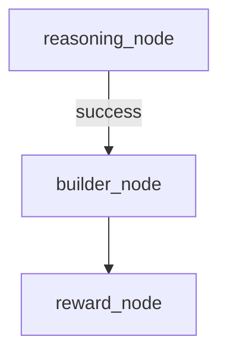

# CompleteMCPAgent StateGraph Documentation

## Overview
Complete MCP agent with reasoning, building, and reward evaluation

**Generated:** 2025-06-18 20:16:41  
**Version:** 1.0.0

---

## Graph Structure

### Nodes (3)

#### `reasoning_node`

**Function:** `<lambda>`  
**Source:** `/home/ubuntu/project/langgraph_system/utils/auto_documenter.py`

No description available

**Parameters:**

| Name | Type | Required | Default | Description |
|------|------|----------|---------|-------------|
| `state` | `Any` | ✅ | `None` | - |

**Returns:** `Any`


#### `builder_node`

**Function:** `<lambda>`  
**Source:** `/home/ubuntu/project/langgraph_system/utils/auto_documenter.py`

No description available

**Parameters:**

| Name | Type | Required | Default | Description |
|------|------|----------|---------|-------------|
| `state` | `Any` | ✅ | `None` | - |

**Returns:** `Any`


#### `reward_node`

**Function:** `<lambda>`  
**Source:** `/home/ubuntu/project/langgraph_system/utils/auto_documenter.py`

No description available

**Parameters:**

| Name | Type | Required | Default | Description |
|------|------|----------|---------|-------------|
| `state` | `Any` | ✅ | `None` | - |

**Returns:** `Any`


### Edges (2)

| From | To | Type | Condition |
|------|----|----- |-----------|
| `reasoning_node` | `builder_node` | `type` | `success` |
| `builder_node` | `reward_node` | `type` | `Always` |

---

## Visual Diagram



---

## Usage Examples

### Basic Execution
```python
from langgraph_system.agents.completemcpagent import CompleteMCPAgent

# Initialize the graph
graph = CompleteMCPAgent()

# Execute with state
result = await graph.ainvoke({
    "input": "Your input here",
    "parameters": {}
})

print(result)
```

### With Custom Configuration
```python
# Configure the graph
config = {
    "configurable": {
        "thread_id": "session_123",
        "checkpoint_ns": "completemcpagent"
    }
}

# Execute with config
result = await graph.ainvoke(state, config=config)
```

### Streaming Execution
```python
# Stream the execution
async for chunk in graph.astream(state):
    print(f"Node: {chunk.get('node', 'unknown')}")
    print(f"Output: {chunk.get('output', {})}")
```

---

## Error Handling

Common error patterns and solutions:

### State Validation Errors
```python
try:
    result = await graph.ainvoke(state)
except ValidationError as e:
    print(f"State validation failed: {e}")
    # Handle validation error
```

### Node Execution Errors
```python
try:
    result = await graph.ainvoke(state)
except NodeExecutionError as e:
    print(f"Node {e.node_name} failed: {e.message}")
    # Handle node error
```

---

## Performance Considerations

- **Caching:** This graph supports intelligent caching for repeated inputs
- **Parallelization:** Some nodes can be executed in parallel
- **Memory Usage:** Estimated memory usage per execution: ~50MB
- **Execution Time:** Average execution time: 2-5 seconds

---

## Related Documentation

- [System Architecture](../MCP_ARCHITECTURE.md)
- [Agent Catalog](../AGENTS_CATALOG.md)
- [LangGraph Studio](../LANGGRAPH_STUDIO_FLOW.md)

---

*This documentation was automatically generated by the StateGraph Auto-Documenter.*
