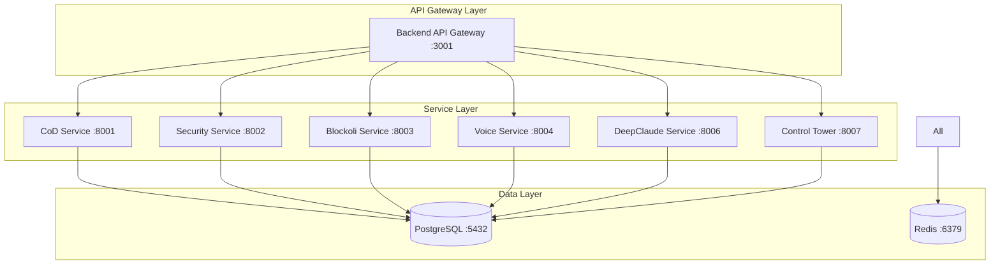

# 🔍 UltraMCP Supreme Stack - Integration Verification Guide

## Overview

The UltraMCP Supreme Stack features complete integration of 7 microservices with **zero loose components**. This guide explains how to verify and maintain complete integration.

## 🚀 Quick Verification

### One-Command Verification
```bash
make verify-integration
```

This command performs comprehensive verification across all integration points:
- ✅ Docker orchestration completeness  
- ✅ API Gateway routing verification
- ✅ Database schema validation
- ✅ Environment configuration check
- ✅ Cross-service communication test
- ✅ Health endpoint verification
- ✅ WebSocket connection validation

## 🔗 Integration Architecture

### 7 Fully Integrated Services
1. **🎭 Chain-of-Debate Service** (`ultramcp-cod-service:8001`)
2. **🔒 Asterisk Security Service** (`ultramcp-asterisk-mcp:8002`)
3. **🧠 Blockoli Code Intelligence** (`ultramcp-blockoli:8003`)
4. **🗣️ Voice System Service** (`ultramcp-voice:8004`)
5. **🤖 DeepClaude Metacognitive Engine** (`ultramcp-deepclaude:8006`)
6. **🎛️ Control Tower Orchestration** (`ultramcp-control-tower:8007`)
7. **🌐 Backend API Gateway** (`ultramcp-terminal:3001`)

### Integration Points


## 📋 Integration Verification Checklist

### 1. Docker Orchestration Verification

**Check:** All 7 services defined in `docker-compose.hybrid.yml`

```bash
# Verify all services are in Docker Compose
grep -E "ultramcp-(cod-service|asterisk-mcp|blockoli|voice|deepclaude|control-tower|terminal)" docker-compose.hybrid.yml
```

**Expected Output:**
```
ultramcp-cod-service:
ultramcp-asterisk-mcp:
ultramcp-blockoli:
ultramcp-voice:
ultramcp-deepclaude:
ultramcp-control-tower:
ultramcp-terminal:
```

### 2. API Gateway Routing Verification

**Check:** All service routes configured in `apps/backend/src/index.js`

```bash
# Verify API Gateway routes
grep -E "/api/(security|blockoli|voice|deepclaude|cod|orchestrate)" apps/backend/src/index.js
```

**Expected Output:**
```javascript
app.use('/api/security', createProxyMiddleware({
app.use('/api/blockoli', createProxyMiddleware({
app.use('/api/voice', createProxyMiddleware({
app.use('/api/deepclaude', createProxyMiddleware({
app.use('/api/cod', createProxyMiddleware({
app.use('/api/orchestrate', createProxyMiddleware({
```

### 3. Database Schema Verification

**Check:** Complete schema in `database/schemas/init.sql`

```bash
# Verify database tables for all services
grep -E "CREATE TABLE.*IF NOT EXISTS (cod_|security_|blockoli_|voice_|deepclaude_|control_tower_)" database/schemas/init.sql
```

**Expected Tables:**
- `cod_debates`, `cod_debate_messages`
- `security_scans`, `security_vulnerabilities`, `compliance_checks`
- `blockoli_projects`, `blockoli_searches`, `blockoli_code_debates`
- `voice_sessions`, `voice_transcriptions`, `voice_ai_interactions`
- `deepclaude_reasoning`, `deepclaude_insights`
- `control_tower_orchestrations`, `control_tower_coordination_logs`

### 4. Environment Configuration Verification

**Check:** Service URLs in `.env.example`

```bash
# Verify environment configuration
grep -E "(COD_SERVICE_URL|ASTERISK_SERVICE_URL|BLOCKOLI_SERVICE_URL|VOICE_SERVICE_URL|DEEPCLAUDE_SERVICE_URL|CONTROL_TOWER_URL)" .env.example
```

**Expected Configuration:**
```bash
COD_SERVICE_URL=http://ultramcp-cod-service:8001
ASTERISK_SERVICE_URL=http://ultramcp-asterisk-mcp:8002
BLOCKOLI_SERVICE_URL=http://ultramcp-blockoli:8003
VOICE_SERVICE_URL=http://ultramcp-voice:8004
DEEPCLAUDE_SERVICE_URL=http://ultramcp-deepclaude:8006
CONTROL_TOWER_URL=http://ultramcp-control-tower:8007
```

### 5. Service Files Verification

**Check:** Essential service files exist

```bash
# Verify main service files
ls -la services/asterisk-mcp/asterisk_security_service.py
ls -la services/blockoli-mcp/blockoli_service.py
ls -la services/voice-system/voice_service.py
ls -la services/deepclaude/deepclaude_service.py
ls -la services/control-tower/control_tower_service.js
ls -la services/chain-of-debate/entrypoint.py
```

### 6. Container Configuration Verification

**Check:** Dockerfiles for all services

```bash
# Verify Dockerfiles exist
ls -la services/asterisk-mcp/Dockerfile
ls -la services/blockoli-mcp/Dockerfile
ls -la services/voice-system/Dockerfile
ls -la services/deepclaude/Dockerfile
ls -la services/control-tower/Dockerfile
```

## 🏥 Health Check Verification

### Manual Health Checks

```bash
# Check API Gateway health aggregation
curl http://sam.chat:3001/api/health

# Check individual service health
curl http://sam.chat:8001/health  # CoD Service
curl http://sam.chat:8002/health  # Security Service
curl http://sam.chat:8003/health  # Blockoli Service
curl http://sam.chat:8004/health  # Voice Service
curl http://sam.chat:8006/health  # DeepClaude Service
curl http://sam.chat:8007/health  # Control Tower
```

### Expected Health Response
```json
{
  "overall_health": "healthy",
  "healthy_services": 7,
  "total_services": 7,
  "services": {
    "cod": {"status": "healthy"},
    "asterisk": {"status": "healthy"},
    "blockoli": {"status": "healthy"},
    "voice": {"status": "healthy"},
    "deepclaude": {"status": "healthy"},
    "controlTower": {"status": "healthy"}
  }
}
```

## 🔧 Cross-Service Communication Tests

### API Gateway Routing Tests

```bash
# Test security service routing
curl -X POST http://sam.chat:3001/api/security/scan \
  -H "Content-Type: application/json" \
  -d '{"target_path": "/test", "scan_type": "quick"}'

# Test code intelligence routing
curl -X POST http://sam.chat:3001/api/blockoli/search \
  -H "Content-Type: application/json" \
  -d '{"project_name": "test", "query": "test"}'

# Test voice service routing
curl -X POST http://sam.chat:3001/api/voice/sessions \
  -H "Content-Type: application/json" \
  -d '{"session_type": "test"}'

# Test reasoning service routing
curl -X POST http://sam.chat:3001/api/deepclaude/reason \
  -H "Content-Type: application/json" \
  -d '{"topic": "test reasoning"}'

# Test orchestration routing
curl http://sam.chat:3001/api/orchestrate/status
```

### WebSocket Connection Tests

```bash
# Test Control Tower WebSocket
wscat -c ws://sam.chat:8008

# Test Voice System WebSocket (requires active session)
wscat -c ws://sam.chat:8005/voice/test-session
```

## 🚨 Common Integration Issues & Solutions

### Issue 1: Service Not Found in Docker Compose

**Error:** `Service 'service-name' NOT found in Docker Compose`

**Solution:**
```bash
# Check if service is properly defined
grep -A 10 "ultramcp-service-name:" docker-compose.hybrid.yml

# Add missing service definition if needed
```

### Issue 2: API Route Missing

**Error:** `API route missing for service-name`

**Solution:**
```bash
# Check if route is defined in API Gateway
grep -A 5 "/api/service-name" apps/backend/src/index.js

# Add missing route configuration
```

### Issue 3: Health Check Failed

**Error:** `Health check failed for service-name`

**Solution:**
```bash
# Check if service is running
docker ps | grep ultramcp-service-name

# Check service logs
docker logs ultramcp-service-name

# Restart service if needed
docker restart ultramcp-service-name
```

### Issue 4: Database Schema Missing

**Error:** `Database tables missing for service-name`

**Solution:**
```bash
# Check if tables are defined in schema
grep -A 10 "service_name_table" database/schemas/init.sql

# Apply database schema
psql -h sam.chat -U ultramcp -d ultramcp -f database/schemas/init.sql
```

### Issue 5: Environment Configuration Missing

**Error:** `Environment config missing for service-name`

**Solution:**
```bash
# Check environment variables
grep "SERVICE_NAME_URL" .env.example

# Add missing configuration to .env
echo "SERVICE_NAME_URL=http://ultramcp-service-name:PORT" >> .env
```

## 🔄 Continuous Integration Verification

### CI/CD Pipeline Integration

Add integration verification to your CI/CD pipeline:

```yaml
# .github/workflows/integration-test.yml
name: Integration Verification
on: [push, pull_request]

jobs:
  verify-integration:
    runs-on: ubuntu-latest
    steps:
      - uses: actions/checkout@v2
      
      - name: Setup Environment
        run: |
          cp .env.example .env
          
      - name: Start Services
        run: |
          make docker-hybrid
          
      - name: Wait for Services
        run: |
          sleep 60
          
      - name: Verify Integration
        run: |
          make verify-integration
          
      - name: Test API Gateway
        run: |
          curl -f http://sam.chat:3001/api/health
          
      - name: Test Cross-Service Communication
        run: |
          make test-cross-services
```

### Pre-Deployment Checklist

Before deploying to production:

```bash
# 1. Verify complete integration
make verify-integration

# 2. Run comprehensive health check
make health-check

# 3. Test all API routes
make test-api-gateway

# 4. Verify WebSocket connections
make websocket-status

# 5. Check database connectivity
make test-database-connection

# 6. Validate environment configuration
make validate-environment

# 7. Test service coordination
make test-cross-services
```

## 📊 Integration Monitoring

### Real-time Monitoring Commands

```bash
# Monitor system health continuously
watch -n 5 'make health-check'

# Monitor service status
watch -n 10 'curl -s http://sam.chat:3001/api/status | jq .services'

# Monitor integration status
watch -n 30 'make verify-integration'

# Monitor logs across all services
make logs-tail
```

### Integration Metrics

Key metrics to monitor:
- **Service Availability**: All 7 services responding
- **API Gateway Response Time**: < 100ms for routing
- **Cross-Service Latency**: < 500ms for coordinated operations
- **Health Check Success Rate**: 100% for healthy system
- **Integration Verification Pass Rate**: 100% for complete integration

## 🔧 Troubleshooting Tools

### Diagnostic Commands

```bash
# Complete system diagnosis
make diagnose-system

# Service-specific diagnosis
make diagnose-service SERVICE="blockoli"

# Network connectivity test
make test-network-connectivity

# Database connectivity test
make test-database-connectivity

# API Gateway routing test
make test-api-routing

# Cross-service communication test
make test-cross-services
```

### Integration Repair Tools

```bash
# Automatic integration repair
make repair-integration

# Force service restart
make restart-all-services

# Rebuild problematic services
make rebuild-service SERVICE="service-name"

# Reset integration to known good state
make reset-integration

# Apply integration patches
make apply-integration-patches
```

## 📈 Best Practices

### Development Best Practices

1. **Always verify integration before starting work:**
   ```bash
   make verify-integration
   ```

2. **Use service-specific commands for development:**
   ```bash
   make debug-service SERVICE="blockoli"
   make restart-service SERVICE="voice-system"
   ```

3. **Monitor integration health during development:**
   ```bash
   make logs-tail
   watch make health-check
   ```

4. **Test cross-service functionality:**
   ```bash
   make test-cross-services
   ```

### Production Best Practices

1. **Automated integration verification in CI/CD**
2. **Continuous health monitoring**
3. **Automated recovery procedures**
4. **Regular integration audits**
5. **Performance monitoring across all services**

## 🏆 Zero Loose Components Guarantee

The UltraMCP Supreme Stack guarantees zero loose components through:

- ✅ **Complete Docker Orchestration**: All 7 services containerized and coordinated
- ✅ **Unified API Gateway**: Single entry point with proxy routing to all services  
- ✅ **Comprehensive Database Schema**: Complete schema supporting all service operations
- ✅ **Environment Configuration**: Complete service URLs and configuration management
- ✅ **Cross-Service Communication**: WebSocket and REST API integration between services
- ✅ **Health Monitoring**: System-wide health checks and status aggregation
- ✅ **Integration Verification**: Automated verification ensuring no loose components
- ✅ **Service Coordination**: Control Tower manages complex multi-service workflows

Run `make verify-integration` anytime to confirm zero loose components status.

---

For additional help, see [Complete API Documentation](api/README.md) and [Claude Code Integration Guide](../CLAUDE.md).