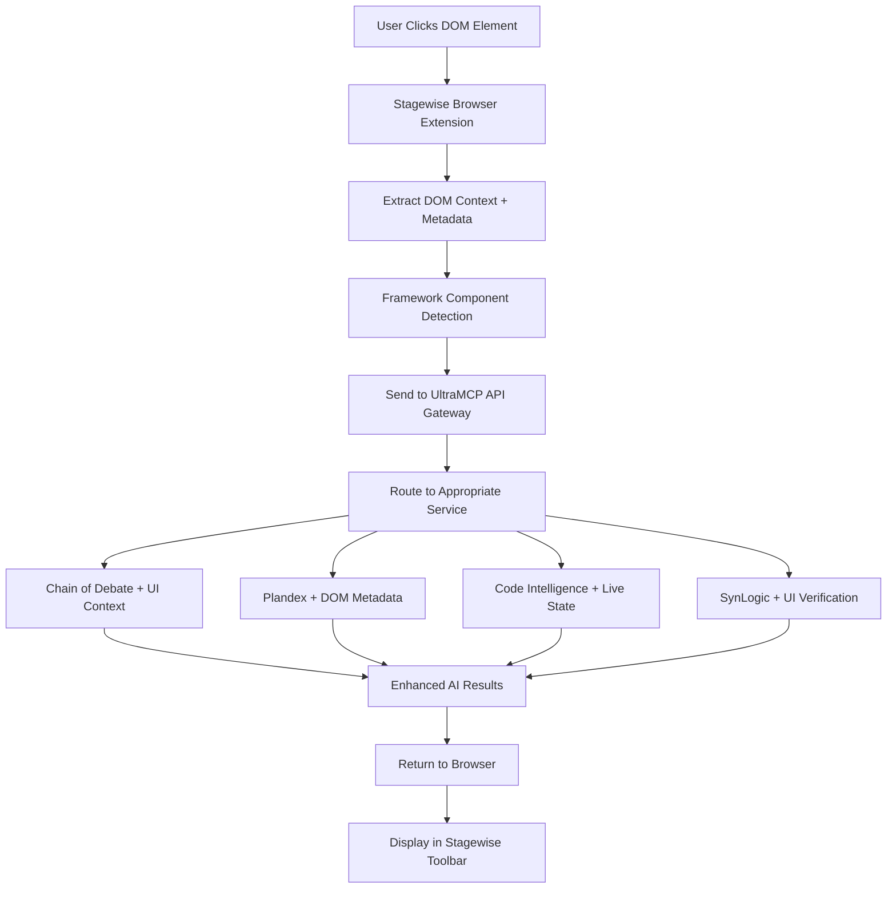

# Stagewise Integration for UltraMCP

🖱️ **Browser-First AI Agent Integration with DOM Context**

Stagewise transforms UltraMCP's multi-agent orchestration by adding real-time browser context and DOM element awareness to Chain of Debate, Plandex planning, and code intelligence services.

## 🌟 Integration Benefits

### 🎭 Enhanced Chain of Debate with UI Context
- **UI-Aware Debates**: Click any DOM element to start contextual AI debates
- **Component-Specific Analysis**: Debate design decisions with actual component context
- **Real-time Feedback**: Integrate user interactions into multi-LLM discussions

### 🤖 Contextual Plandex Planning
- **Element-Driven Planning**: Create project plans based on specific UI components
- **Interactive Workflows**: Plan refactoring by clicking elements that need work
- **Context-Rich Sessions**: Planning with browser state and DOM metadata

### 🧠 DOM-Enhanced Code Intelligence
- **Live Component Analysis**: Analyze components while browsing the live application
- **Usage Pattern Detection**: Track how users interact with components for better insights
- **Runtime Context**: Combine static code analysis with live DOM state

### 🔬 Scientific UI Testing with SynLogic
- **Measurable UI Decisions**: Apply SynLogic verification to UI/UX design choices
- **A/B Testing Integration**: Objective measurement of design decisions
- **Component Performance**: Track component effectiveness with scientific rigor

## 🚀 Quick Start

### Prerequisites
```bash
# Existing UltraMCP services
- Chain of Debate service running
- Plandex integration active
- SynLogic CoD integration

# New requirements for Stagewise
- Modern web browser (Chrome, Firefox, Edge)
- React/Next.js/Vue/Nuxt.js project
- Node.js 18+ for framework integration
```

### 1. Install Stagewise Browser Extension

```bash
# Install from Chrome Web Store or Firefox Add-ons
# (Links will be provided when extension is published)

# Or install development version
git clone https://github.com/stagewise-io/stagewise.git
cd stagewise/extension
npm install
npm run build
# Load unpacked extension in Chrome Developer Mode
```

### 2. Add Framework Integration

For React/Next.js projects:
```bash
npm install @stagewise/react
```

For Vue/Nuxt.js projects:
```bash
npm install @stagewise/vue
```

### 3. Initialize in Your Project

**React Integration:**
```tsx
// pages/_app.tsx or main component
import { StageWiseToolbar } from '@stagewise/react';

export default function App({ Component, pageProps }) {
  return (
    <>
      {process.env.NODE_ENV === 'development' && (
        <StageWiseToolbar 
          ultramcpEndpoint="http://localhost:3001"
          enableCoD={true}
          enablePlandex={true}
          enableCodeIntelligence={true}
        />
      )}
      <Component {...pageProps} />
    </>
  );
}
```

**Vue Integration:**
```vue
<!-- App.vue -->
<template>
  <div>
    <StageWiseToolbar 
      v-if="isDevelopment"
      :ultramcp-endpoint="ultramcpEndpoint"
      :enable-cod="true"
      :enable-plandex="true"
      :enable-code-intelligence="true"
    />
    <router-view />
  </div>
</template>

<script>
import { StageWiseToolbar } from '@stagewise/vue';

export default {
  components: { StageWiseToolbar },
  data() {
    return {
      isDevelopment: process.env.NODE_ENV === 'development',
      ultramcpEndpoint: 'http://localhost:3001'
    };
  }
};
</script>
```

### 4. Configure UltraMCP Integration

Add Stagewise endpoints to your UltraMCP API Gateway:

```javascript
// apps/backend/src/index.js - Add to existing API Gateway
app.use('/api/stagewise', createProxyMiddleware({
  target: 'http://ultramcp-stagewise:8080',
  changeOrigin: true,
  pathRewrite: {
    '^/api/stagewise': ''
  }
}));
```

## 🎯 Usage Examples

### 1. **UI-Contextual Chain of Debate**

```bash
# User clicks a button in browser → Stagewise captures DOM context
# Then runs enhanced CoD with UI context

# Example: User clicks "Submit" button
# Stagewise automatically triggers:
python3 cod-synlogic-integration-fixed.py debate \
  "Should this submit button be redesigned?" \
  --ui-context="button#submit" \
  --dom-metadata="{styles, computed, events}" \
  --component-path="components/forms/SubmitButton.tsx"
```

**Result**: CoD debate with actual button styles, computed properties, and component context.

### 2. **Contextual Plandex Planning**

```bash
# User clicks form component → Stagewise creates planning session
curl -X POST http://localhost:7778/api/planning/session \
  -H "Content-Type: application/json" \
  -d '{
    "topic": "Refactor form validation system",
    "agents": ["claude-memory", "chain-of-debate"],
    "ui_context": {
      "element": "form.user-registration",
      "component_path": "components/UserRegistrationForm.tsx",
      "dom_state": {...},
      "user_interaction": "clicked_submit_with_validation_errors"
    }
  }'
```

**Result**: Plandex creates refactoring plan with actual form context and user behavior data.

### 3. **Live Code Intelligence**

```bash
# User hovers over component → Stagewise triggers analysis
make code-search QUERY="similar components" PROJECT="my-app" \
  --live-context="component:UserCard" \
  --dom-metadata="{props, state, events}" \
  --usage-patterns="viewed_1247_times_avg_3s"
```

**Result**: Code intelligence enhanced with runtime usage data and DOM context.

### 4. **Scientific UI Testing**

```bash
# A/B test different button designs with SynLogic verification
python3 cod-synlogic-integration-fixed.py debate \
  "Button design A vs B effectiveness" \
  --ui-context="button.variant-a,button.variant-b" \
  --metrics="click_rate,conversion,user_satisfaction" \
  --verification-data="test_results.json"
```

**Result**: Objective measurement of UI design effectiveness with scientific rigor.

## 🔧 Technical Architecture

### Browser Extension ↔ UltraMCP Flow



### Integration Components

**1. Stagewise Service (New)**
```bash
# Add to docker-compose.hybrid.yml
ultramcp-stagewise:
  build: ./stagewise-integration/service
  ports:
    - "8080:8080"
  environment:
    - COD_SERVICE_URL=http://ultramcp-cod-service:8001
    - PLANDEX_SERVICE_URL=http://ultramcp-simple-agent-registry:7778
    - BLOCKOLI_SERVICE_URL=http://ultramcp-blockoli:8003
  networks:
    - ultramcp
```

**2. Browser Extension Integration**
- Captures DOM context and metadata
- Framework-aware component detection
- Real-time communication with UltraMCP services
- Toolbar UI for displaying AI results

**3. Enhanced Service APIs**
- CoD with UI context parameters
- Plandex with DOM metadata
- Code intelligence with live state
- SynLogic with UI verification data

## 📊 Enhanced Capabilities

### Before Stagewise Integration:
```bash
# Generic code analysis
make code-search QUERY="button components" PROJECT="my-app"

# Abstract debates
python3 cod-synlogic-integration-fixed.py debate "UI design principles"

# General planning
curl -X POST .../api/planning/session -d '{"topic": "improve forms"}'
```

### After Stagewise Integration:
```bash
# Contextual analysis with live DOM
make code-search QUERY="optimize this button" PROJECT="my-app" \
  --element="button#checkout" \
  --runtime-context="{state, props, events}"

# UI-specific debates with real data
python3 cod-synlogic-integration-fixed.py debate "optimize checkout button" \
  --ui-context="button#checkout" \
  --performance-data="click_rate:0.23,bounce:0.45"

# Component-driven planning
curl -X POST .../api/planning/session \
  -d '{"topic": "improve checkout flow", "ui_context": {...dom_data...}}'
```

## 🎯 Unique Value Propositions

### 1. **First Browser-Native Multi-Agent Orchestration**
- No more copying file paths or describing UI elements
- Direct DOM manipulation triggers AI agent coordination
- Real-time context sharing between browser and AI services

### 2. **Scientific UI/UX Measurement**
- Apply SynLogic's objective reasoning to design decisions
- Measure UI effectiveness with scientific rigor
- A/B test designs with verifiable metrics

### 3. **Live Development Intelligence**
- Code intelligence enhanced with runtime context
- Component analysis with actual usage patterns
- Performance insights combined with static analysis

### 4. **Contextual Planning and Orchestration**
- Plandex planning with real UI component context
- Multi-agent coordination triggered by user interactions
- Development workflows driven by actual user behavior

## 🚀 Installation Script

Run this to add Stagewise integration to existing UltraMCP:

```bash
# Download and run Stagewise integration setup
curl -fsSL https://raw.githubusercontent.com/yourusername/ultramcp/main/stagewise-integration/install-stagewise.sh | bash

# Or manual installation
git clone https://github.com/yourusername/ultramcp.git
cd ultramcp/stagewise-integration
./install-stagewise.sh
```

## 📈 Roadmap

### Immediate (Next 30 Days)
- [ ] Complete Stagewise service implementation
- [ ] Browser extension integration with UltraMCP API
- [ ] Framework toolbars for React/Vue/Next.js/Nuxt.js
- [ ] Basic DOM context capture and routing

### Near-term (Next 90 Days)
- [ ] Advanced component detection and analysis
- [ ] Real-time collaboration between browser and AI agents
- [ ] Performance metrics integration with UI decisions
- [ ] Visual feedback system in browser toolbar

### Long-term (Next 6 Months)
- [ ] ML-powered component recommendation system
- [ ] Automated UI optimization based on AI insights
- [ ] Cross-framework component analysis and migration
- [ ] Enterprise-grade security and compliance for browser integration

---

🖱️ **Transform your development workflow with browser-first AI agent orchestration!**

Stagewise bridges the gap between what you see in the browser and what AI agents understand, enabling unprecedented contextual intelligence for web development.